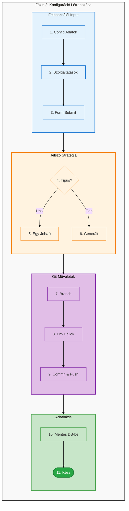

# Fázis 2: Konfiguráció Létrehozása

```mermaid
%%{init: {"theme": "base", "themeVariables": { "fontSize": "14px"}}}%%
flowchart LR
    subgraph PHASE2 ["Fázis 2: Konfiguráció Létrehozása"]
        direction TB
        
        subgraph SUB1 ["Felhasználói Input"]
            direction TB
            P1["1. Config Adatok"] --> P2["2. Szolgáltatások"]
            P2 --> P3["3. Form Submit"]
        end
        
        subgraph SUB2 ["Jelszó Stratégia"]
            direction TB
            P4{4. Típus?}
            P4 -->|Univ| P5["5. Egy Jelszó"]
            P4 -->|Gen| P6["6. Generált"]
        end
        
        subgraph SUB3 ["Git Műveletek"]
            direction TB
            P7["7. Branch"] --> P8["8. Env Fájlok"]
            P8 --> P9["9. Commit & Push"]
        end
        
        subgraph SUB4 ["Adatbázis"]
            direction TB
            P10["10. Mentés DB-be"] --> P11(["11. Kész"])
        end
        
        SUB1 --> SUB2 --> SUB3 --> SUB4
    end

    %% --- STYLING ---
    style PHASE2 fill:#f9f9f9,stroke:#333,stroke-width:2px
    
    style SUB1 fill:#e3f2fd,stroke:#1976d2,stroke-width:2px
    style SUB2 fill:#fff3e0,stroke:#f57c00,stroke-width:2px
    style SUB3 fill:#e1bee7,stroke:#7b1fa2,stroke-width:2px
    style SUB4 fill:#c8e6c9,stroke:#43a047,stroke-width:2px
    
    style P1 fill:#e3f2fd,stroke:#1976d2,stroke-width:1px
    style P2 fill:#e3f2fd,stroke:#1976d2,stroke-width:1px
    style P3 fill:#e3f2fd,stroke:#1976d2,stroke-width:1px
    
    style P4 fill:#fff3e0,stroke:#f57c00,stroke-width:1px
    style P5 fill:#fff3e0,stroke:#f57c00,stroke-width:1px
    style P6 fill:#fff3e0,stroke:#f57c00,stroke-width:1px
    
    style P7 fill:#e1bee7,stroke:#7b1fa2,stroke-width:1px
    style P8 fill:#e1bee7,stroke:#7b1fa2,stroke-width:1px
    style P9 fill:#e1bee7,stroke:#7b1fa2,stroke-width:1px
    
    style P10 fill:#c8e6c9,stroke:#43a047,stroke-width:1px
    style P11 fill:#28a745,stroke:#1e7e34,color:#ffffff,stroke-width:2px
```
