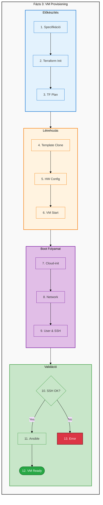

# Fázis 3: VM Provisioning

```mermaid
%%{init: {"theme": "base", "themeVariables": { "fontSize": "14px"}}}%%
flowchart LR
    subgraph PHASE3 ["Fázis 3: VM Provisioning"]
        direction TB
        
        subgraph SUB1 ["Előkészítés"]
            direction TB
            P1["1. Specifikáció"] --> P2["2. Terraform Init"]
            P2 --> P3["3. TF Plan"]
        end
        
        subgraph SUB2 ["Létrehozás"]
            direction TB
            P4["4. Template Clone"] --> P5["5. HW Config"]
            P5 --> P6["6. VM Start"]
        end
        
        subgraph SUB3 ["Boot Folyamat"]
            direction TB
            P7["7. Cloud-init"] --> P8["8. Network"]
            P8 --> P9["9. User & SSH"]
        end
        
        subgraph SUB4 ["Validáció"]
            direction TB
            P10{10. SSH OK?}
            P10 -->|Yes| P11["11. Ansible"]
            P11 --> P12(["12. VM Ready"])
            P10 -->|No| P13["13. Error"]
        end
        
        SUB1 --> SUB2 --> SUB3 --> SUB4
    end

    %% --- STYLING ---
    style PHASE3 fill:#f9f9f9,stroke:#333,stroke-width:2px
    
    style SUB1 fill:#e3f2fd,stroke:#1976d2,stroke-width:2px
    style SUB2 fill:#fff3e0,stroke:#f57c00,stroke-width:2px
    style SUB3 fill:#e1bee7,stroke:#7b1fa2,stroke-width:2px
    style SUB4 fill:#c8e6c9,stroke:#43a047,stroke-width:2px
    
    style P1 fill:#e3f2fd,stroke:#1976d2,stroke-width:1px
    style P2 fill:#e3f2fd,stroke:#1976d2,stroke-width:1px
    style P3 fill:#e3f2fd,stroke:#1976d2,stroke-width:1px
    
    style P4 fill:#fff3e0,stroke:#f57c00,stroke-width:1px
    style P5 fill:#fff3e0,stroke:#f57c00,stroke-width:1px
    style P6 fill:#fff3e0,stroke:#f57c00,stroke-width:1px
    
    style P7 fill:#e1bee7,stroke:#7b1fa2,stroke-width:1px
    style P8 fill:#e1bee7,stroke:#7b1fa2,stroke-width:1px
    style P9 fill:#e1bee7,stroke:#7b1fa2,stroke-width:1px
    
    style P10 fill:#c8e6c9,stroke:#43a047,stroke-width:1px
    style P11 fill:#c8e6c9,stroke:#43a047,stroke-width:1px
    style P12 fill:#28a745,stroke:#1e7e34,color:#ffffff,stroke-width:2px
    style P13 fill:#dc3545,stroke:#842029,color:#ffffff,stroke-width:2px
```
