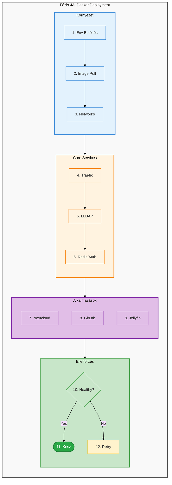

# Fázis 4A: Docker Deployment

```mermaid
%%{init: {"theme": "base", "themeVariables": { "fontSize": "14px"}}}%%
flowchart LR
    subgraph PHASE4A ["Fázis 4A: Docker Deployment"]
        direction TB
        
        subgraph SUB1 ["Környezet"]
            direction TB
            P1["1. Env Betöltés"] --> P2["2. Image Pull"]
            P2 --> P3["3. Networks"]
        end
        
        subgraph SUB2 ["Core Services"]
            direction TB
            P4["4. Traefik"] --> P5["5. LLDAP"]
            P5 --> P6["6. Redis/Auth"]
        end
        
        subgraph SUB3 ["Alkalmazások"]
            direction TB
            P7["7. Nextcloud"]
            P8["8. GitLab"]
            P9["9. Jellyfin"]
        end
        
        subgraph SUB4 ["Ellenőrzés"]
            direction TB
            P10{10. Healthy?}
            P10 -->|Yes| P11(["11. Kész"])
            P10 -->|No| P12["12. Retry"]
        end
        
        SUB1 --> SUB2 --> SUB3 --> SUB4
    end

    %% --- STYLING ---
    style PHASE4A fill:#f9f9f9,stroke:#333,stroke-width:2px
    
    style SUB1 fill:#e3f2fd,stroke:#1976d2,stroke-width:2px
    style SUB2 fill:#fff3e0,stroke:#f57c00,stroke-width:2px
    style SUB3 fill:#e1bee7,stroke:#7b1fa2,stroke-width:2px
    style SUB4 fill:#c8e6c9,stroke:#43a047,stroke-width:2px
    
    style P1 fill:#e3f2fd,stroke:#1976d2,stroke-width:1px
    style P2 fill:#e3f2fd,stroke:#1976d2,stroke-width:1px
    style P3 fill:#e3f2fd,stroke:#1976d2,stroke-width:1px
    
    style P4 fill:#fff3e0,stroke:#f57c00,stroke-width:1px
    style P5 fill:#fff3e0,stroke:#f57c00,stroke-width:1px
    style P6 fill:#fff3e0,stroke:#f57c00,stroke-width:1px
    
    style P7 fill:#e1bee7,stroke:#7b1fa2,stroke-width:1px
    style P8 fill:#e1bee7,stroke:#7b1fa2,stroke-width:1px
    style P9 fill:#e1bee7,stroke:#7b1fa2,stroke-width:1px
    
    style P10 fill:#c8e6c9,stroke:#43a047,stroke-width:1px
    style P11 fill:#28a745,stroke:#1e7e34,color:#ffffff,stroke-width:2px
    style P12 fill:#fff3cd,stroke:#ffc107,stroke-width:1px
```
