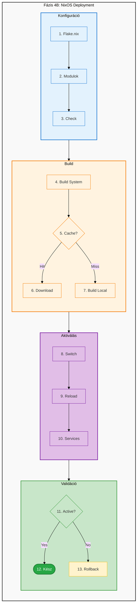

# Fázis 4B: NixOS Deployment

```mermaid
%%{init: {"theme": "base", "themeVariables": { "fontSize": "14px"}}}%%
flowchart LR
    subgraph PHASE4B ["Fázis 4B: NixOS Deployment"]
        direction TB
        
        subgraph SUB1 ["Konfiguráció"]
            direction TB
            P1["1. Flake.nix"] --> P2["2. Modulok"]
            P2 --> P3["3. Check"]
        end
        
        subgraph SUB2 ["Build"]
            direction TB
            P4["4. Build System"] --> P5{5. Cache?}
            P5 -->|Hit| P6["6. Download"]
            P5 -->|Miss| P7["7. Build Local"]
        end
        
        subgraph SUB3 ["Aktiválás"]
            direction TB
            P8["8. Switch"] --> P9["9. Reload"]
            P9 --> P10["10. Services"]
        end
        
        subgraph SUB4 ["Validáció"]
            direction TB
            P11{11. Active?}
            P11 -->|Yes| P12(["12. Kész"])
            P11 -->|No| P13["13. Rollback"]
        end
        
        SUB1 --> SUB2 --> SUB3 --> SUB4
    end

    %% --- STYLING ---
    style PHASE4B fill:#f9f9f9,stroke:#333,stroke-width:2px
    
    style SUB1 fill:#e3f2fd,stroke:#1976d2,stroke-width:2px
    style SUB2 fill:#fff3e0,stroke:#f57c00,stroke-width:2px
    style SUB3 fill:#e1bee7,stroke:#7b1fa2,stroke-width:2px
    style SUB4 fill:#c8e6c9,stroke:#43a047,stroke-width:2px
    
    style P1 fill:#e3f2fd,stroke:#1976d2,stroke-width:1px
    style P2 fill:#e3f2fd,stroke:#1976d2,stroke-width:1px
    style P3 fill:#e3f2fd,stroke:#1976d2,stroke-width:1px
    
    style P4 fill:#fff3e0,stroke:#f57c00,stroke-width:1px
    style P5 fill:#fff3e0,stroke:#f57c00,stroke-width:1px
    style P6 fill:#fff3e0,stroke:#f57c00,stroke-width:1px
    style P7 fill:#fff3e0,stroke:#f57c00,stroke-width:1px
    
    style P8 fill:#e1bee7,stroke:#7b1fa2,stroke-width:1px
    style P9 fill:#e1bee7,stroke:#7b1fa2,stroke-width:1px
    style P10 fill:#e1bee7,stroke:#7b1fa2,stroke-width:1px
    
    style P11 fill:#c8e6c9,stroke:#43a047,stroke-width:1px
    style P12 fill:#28a745,stroke:#1e7e34,color:#ffffff,stroke-width:2px
    style P13 fill:#fff3cd,stroke:#ffc107,stroke-width:1px
```
