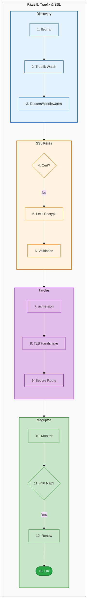

# Fázis 5: Traefik & SSL

```mermaid
%%{init: {"theme": "base", "themeVariables": { "fontSize": "14px"}}}%%
flowchart LR
    subgraph PHASE5 ["Fázis 5: Traefik & SSL"]
        direction TB
        
        subgraph SUB1 ["Discovery"]
            direction TB
            P1["1. Events"] --> P2["2. Traefik Watch"]
            P2 --> P3["3. Routers/Middlewares"]
        end
        
        subgraph SUB2 ["SSL Kérés"]
            direction TB
            P4{4. Cert?}
            P4 -->|No| P5["5. Let's Encrypt"]
            P5 --> P6["6. Validation"]
        end
        
        subgraph SUB3 ["Tárolás"]
            direction TB
            P7["7. acme.json"] --> P8["8. TLS Handshake"]
            P8 --> P9["9. Secure Route"]
        end
        
        subgraph SUB4 ["Megújítás"]
            direction TB
            P10["10. Monitor"] --> P11{11. <30 Nap?}
            P11 -->|Yes| P12["12. Renew"]
            P12 --> P13(["13. OK"])
        end
        
        SUB1 --> SUB2 --> SUB3 --> SUB4
    end

    %% --- STYLING ---
    style PHASE5 fill:#f9f9f9,stroke:#333,stroke-width:2px
    
    style SUB1 fill:#e3f2fd,stroke:#1976d2,stroke-width:2px
    style SUB2 fill:#fff3e0,stroke:#f57c00,stroke-width:2px
    style SUB3 fill:#e1bee7,stroke:#7b1fa2,stroke-width:2px
    style SUB4 fill:#c8e6c9,stroke:#43a047,stroke-width:2px
    
    style P1 fill:#e3f2fd,stroke:#1976d2,stroke-width:1px
    style P2 fill:#e3f2fd,stroke:#1976d2,stroke-width:1px
    style P3 fill:#e3f2fd,stroke:#1976d2,stroke-width:1px
    
    style P4 fill:#fff3e0,stroke:#f57c00,stroke-width:1px
    style P5 fill:#fff3e0,stroke:#f57c00,stroke-width:1px
    style P6 fill:#fff3e0,stroke:#f57c00,stroke-width:1px
    
    style P7 fill:#e1bee7,stroke:#7b1fa2,stroke-width:1px
    style P8 fill:#e1bee7,stroke:#7b1fa2,stroke-width:1px
    style P9 fill:#e1bee7,stroke:#7b1fa2,stroke-width:1px
    
    style P10 fill:#c8e6c9,stroke:#43a047,stroke-width:1px
    style P11 fill:#c8e6c9,stroke:#43a047,stroke-width:1px
    style P12 fill:#c8e6c9,stroke:#43a047,stroke-width:1px
    style P13 fill:#28a745,stroke:#1e7e34,color:#ffffff,stroke-width:2px
```
