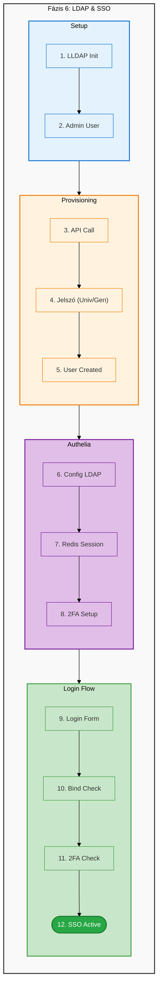

# Fázis 6: LDAP & Authelia SSO

```mermaid
%%{init: {"theme": "base", "themeVariables": { "fontSize": "14px"}}}%%
flowchart LR
    subgraph PHASE6 ["Fázis 6: LDAP & SSO"]
        direction TB
        
        subgraph SUB1 ["Setup"]
            direction TB
            P1["1. LLDAP Init"] --> P2["2. Admin User"]
        end
        
        subgraph SUB2 ["Provisioning"]
            direction TB
            P3["3. API Call"] --> P4["4. Jelszó (Univ/Gen)"]
            P4 --> P5["5. User Created"]
        end
        
        subgraph SUB3 ["Authelia"]
            direction TB
            P6["6. Config LDAP"] --> P7["7. Redis Session"]
            P7 --> P8["8. 2FA Setup"]
        end
        
        subgraph SUB4 ["Login Flow"]
            direction TB
            P9["9. Login Form"] --> P10["10. Bind Check"]
            P10 --> P11["11. 2FA Check"]
            P11 --> P12(["12. SSO Active"])
        end
        
        SUB1 --> SUB2 --> SUB3 --> SUB4
    end

    %% --- STYLING ---
    style PHASE6 fill:#f9f9f9,stroke:#333,stroke-width:2px
    
    style SUB1 fill:#e3f2fd,stroke:#1976d2,stroke-width:2px
    style SUB2 fill:#fff3e0,stroke:#f57c00,stroke-width:2px
    style SUB3 fill:#e1bee7,stroke:#7b1fa2,stroke-width:2px
    style SUB4 fill:#c8e6c9,stroke:#43a047,stroke-width:2px
    
    style P1 fill:#e3f2fd,stroke:#1976d2,stroke-width:1px
    style P2 fill:#e3f2fd,stroke:#1976d2,stroke-width:1px
    
    style P3 fill:#fff3e0,stroke:#f57c00,stroke-width:1px
    style P4 fill:#fff3e0,stroke:#f57c00,stroke-width:1px
    style P5 fill:#fff3e0,stroke:#f57c00,stroke-width:1px
    
    style P6 fill:#e1bee7,stroke:#7b1fa2,stroke-width:1px
    style P7 fill:#e1bee7,stroke:#7b1fa2,stroke-width:1px
    style P8 fill:#e1bee7,stroke:#7b1fa2,stroke-width:1px
    
    style P9 fill:#c8e6c9,stroke:#43a047,stroke-width:1px
    style P10 fill:#c8e6c9,stroke:#43a047,stroke-width:1px
    style P11 fill:#c8e6c9,stroke:#43a047,stroke-width:1px
    style P12 fill:#28a745,stroke:#1e7e34,color:#ffffff,stroke-width:2px
```
