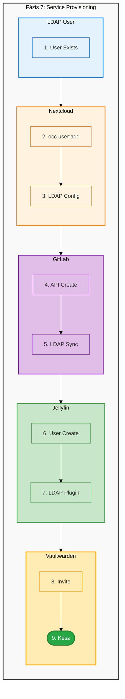

# Fázis 7: Szolgáltatás Provisioning

```mermaid
%%{init: {"theme": "base", "themeVariables": { "fontSize": "14px"}}}%%
flowchart LR
    subgraph PHASE7 ["Fázis 7: Service Provisioning"]
        direction TB
        
        subgraph SUB1 ["LDAP User"]
            direction TB
            P1["1. User Exists"]
        end
        
        subgraph SUB2 ["Nextcloud"]
            direction TB
            P2["2. occ user:add"] --> P3["3. LDAP Config"]
        end
        
        subgraph SUB3 ["GitLab"]
            direction TB
            P4["4. API Create"] --> P5["5. LDAP Sync"]
        end
        
        subgraph SUB4 ["Jellyfin"]
            direction TB
            P6["6. User Create"] --> P7["7. LDAP Plugin"]
        end
        
        subgraph SUB5 ["Vaultwarden"]
            direction TB
            P8["8. Invite"] --> P9(["9. Kész"])
        end
        
        SUB1 --> SUB2 --> SUB3 --> SUB4 --> SUB5
    end

    %% --- STYLING ---
    style PHASE7 fill:#f9f9f9,stroke:#333,stroke-width:2px
    
    style SUB1 fill:#e3f2fd,stroke:#1976d2,stroke-width:2px
    style SUB2 fill:#fff3e0,stroke:#f57c00,stroke-width:2px
    style SUB3 fill:#e1bee7,stroke:#7b1fa2,stroke-width:2px
    style SUB4 fill:#c8e6c9,stroke:#43a047,stroke-width:2px
    style SUB5 fill:#ffecb3,stroke:#ffa000,stroke-width:2px
    
    style P1 fill:#e3f2fd,stroke:#1976d2,stroke-width:1px
    
    style P2 fill:#fff3e0,stroke:#f57c00,stroke-width:1px
    style P3 fill:#fff3e0,stroke:#f57c00,stroke-width:1px
    
    style P4 fill:#e1bee7,stroke:#7b1fa2,stroke-width:1px
    style P5 fill:#e1bee7,stroke:#7b1fa2,stroke-width:1px
    
    style P6 fill:#c8e6c9,stroke:#43a047,stroke-width:1px
    style P7 fill:#c8e6c9,stroke:#43a047,stroke-width:1px
    
    style P8 fill:#ffecb3,stroke:#ffa000,stroke-width:1px
    style P9 fill:#28a745,stroke:#1e7e34,color:#ffffff,stroke-width:2px
```
