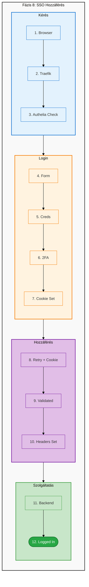

# Fázis 8: User Access SSO

```mermaid
%%{init: {"theme": "base", "themeVariables": { "fontSize": "14px"}}}%%
flowchart LR
    subgraph PHASE8 ["Fázis 8: SSO Hozzáférés"]
        direction TB
        
        subgraph SUB1 ["Kérés"]
            direction TB
            P1["1. Browser"] --> P2["2. Traefik"]
            P2 --> P3["3. Authelia Check"]
        end
        
        subgraph SUB2 ["Login"]
            direction TB
            P4["4. Form"] --> P5["5. Creds"]
            P5 --> P6["6. 2FA"]
            P6 --> P7["7. Cookie Set"]
        end
        
        subgraph SUB3 ["Hozzáférés"]
            direction TB
            P8["8. Retry + Cookie"] --> P9["9. Validated"]
            P9 --> P10["10. Headers Set"]
        end
        
        subgraph SUB4 ["Szolgáltatás"]
            direction TB
            P11["11. Backend"] --> P12(["12. Logged In"])
        end
        
        SUB1 --> SUB2 --> SUB3 --> SUB4
    end

    %% --- STYLING ---
    style PHASE8 fill:#f9f9f9,stroke:#333,stroke-width:2px
    
    style SUB1 fill:#e3f2fd,stroke:#1976d2,stroke-width:2px
    style SUB2 fill:#fff3e0,stroke:#f57c00,stroke-width:2px
    style SUB3 fill:#e1bee7,stroke:#7b1fa2,stroke-width:2px
    style SUB4 fill:#c8e6c9,stroke:#43a047,stroke-width:2px
    
    style P1 fill:#e3f2fd,stroke:#1976d2,stroke-width:1px
    style P2 fill:#e3f2fd,stroke:#1976d2,stroke-width:1px
    style P3 fill:#e3f2fd,stroke:#1976d2,stroke-width:1px
    
    style P4 fill:#fff3e0,stroke:#f57c00,stroke-width:1px
    style P5 fill:#fff3e0,stroke:#f57c00,stroke-width:1px
    style P6 fill:#fff3e0,stroke:#f57c00,stroke-width:1px
    style P7 fill:#fff3e0,stroke:#f57c00,stroke-width:1px
    
    style P8 fill:#e1bee7,stroke:#7b1fa2,stroke-width:1px
    style P9 fill:#e1bee7,stroke:#7b1fa2,stroke-width:1px
    style P10 fill:#e1bee7,stroke:#7b1fa2,stroke-width:1px
    
    style P11 fill:#c8e6c9,stroke:#43a047,stroke-width:1px
    style P12 fill:#28a745,stroke:#1e7e34,color:#ffffff,stroke-width:2px
```
