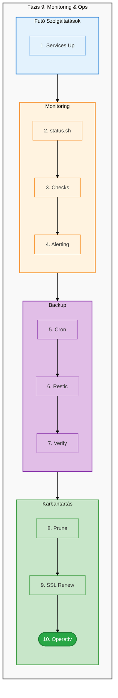

# Fázis 9: Monitoring

```mermaid
%%{init: {"theme": "base", "themeVariables": { "fontSize": "14px"}}}%%
flowchart LR
    subgraph PHASE9 ["Fázis 9: Monitoring & Ops"]
        direction TB
        
        subgraph SUB1 ["Futó Szolgáltatások"]
            direction TB
            P1["1. Services Up"]
        end
        
        subgraph SUB2 ["Monitoring"]
            direction TB
            P2["2. status.sh"] --> P3["3. Checks"]
            P3 --> P4["4. Alerting"]
        end
        
        subgraph SUB3 ["Backup"]
            direction TB
            P5["5. Cron"] --> P6["6. Restic"]
            P6 --> P7["7. Verify"]
        end
        
        subgraph SUB4 ["Karbantartás"]
            direction TB
            P8["8. Prune"] --> P9["9. SSL Renew"]
            P9 --> P10(["10. Operatív"])
        end
        
        SUB1 --> SUB2 --> SUB3 --> SUB4
    end

    %% --- STYLING ---
    style PHASE9 fill:#f9f9f9,stroke:#333,stroke-width:2px
    
    style SUB1 fill:#e3f2fd,stroke:#1976d2,stroke-width:2px
    style SUB2 fill:#fff3e0,stroke:#f57c00,stroke-width:2px
    style SUB3 fill:#e1bee7,stroke:#7b1fa2,stroke-width:2px
    style SUB4 fill:#c8e6c9,stroke:#43a047,stroke-width:2px
    
    style P1 fill:#e3f2fd,stroke:#1976d2,stroke-width:1px
    
    style P2 fill:#fff3e0,stroke:#f57c00,stroke-width:1px
    style P3 fill:#fff3e0,stroke:#f57c00,stroke-width:1px
    style P4 fill:#fff3e0,stroke:#f57c00,stroke-width:1px
    
    style P5 fill:#e1bee7,stroke:#7b1fa2,stroke-width:1px
    style P6 fill:#e1bee7,stroke:#7b1fa2,stroke-width:1px
    style P7 fill:#e1bee7,stroke:#7b1fa2,stroke-width:1px
    
    style P8 fill:#c8e6c9,stroke:#43a047,stroke-width:1px
    style P9 fill:#c8e6c9,stroke:#43a047,stroke-width:1px
    style P10 fill:#28a745,stroke:#1e7e34,color:#ffffff,stroke-width:2px
```
