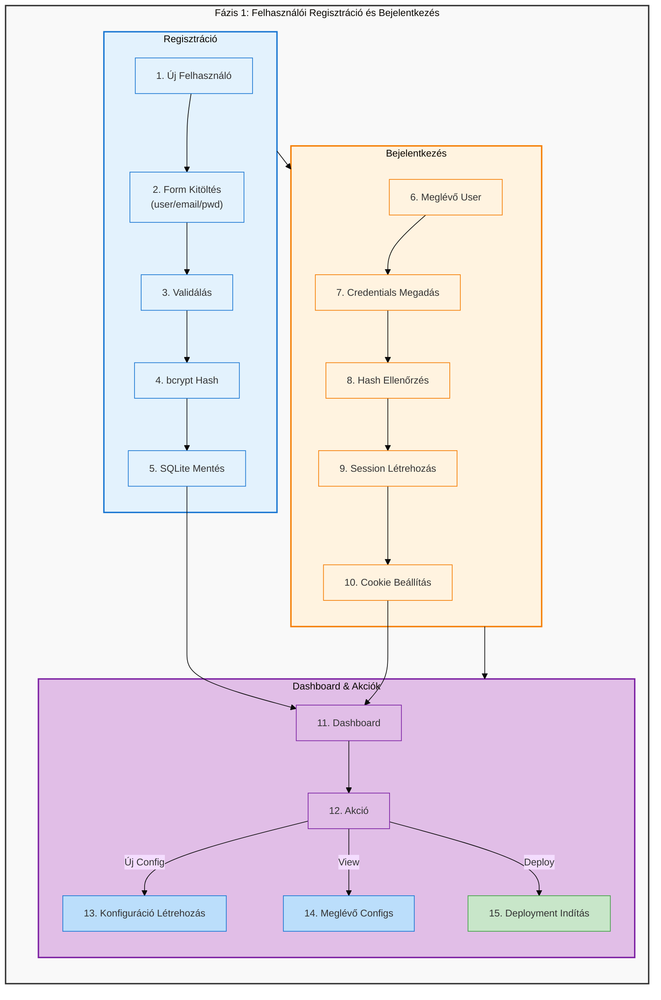

# Fázis 1: Felhasználói Regisztráció és Bejelentkezés

```mermaid
%%{init: {"theme": "base", "themeVariables": { "fontSize": "14px"}}}%%
flowchart LR

    subgraph PHASE1_ONBOARDING ["Fázis 1: Felhasználói Regisztráció és Bejelentkezés"]
        direction TB

        subgraph REGISTRATION_PROCESS ["Regisztráció"]
            direction TB
            P1["1. Új Felhasználó"] --> P2["2. Form Kitöltés<br/>(user/email/pwd)"]
            P2 --> P3["3. Validálás"]
            P3 --> P4["4. bcrypt Hash"]
            P4 --> P5["5. SQLite Mentés"]
        end

        subgraph LOGIN_PROCESS ["Bejelentkezés"]
            direction TB
            P6["6. Meglévő User"] --> P7["7. Credentials Megadás"]
            P7 --> P8["8. Hash Ellenőrzés"]
            P8 --> P9["9. Session Létrehozás"]
            P9 --> P10["10. Cookie Beállítás"]
        end
        
        subgraph DASHBOARD_ACCESS ["Dashboard & Akciók"]
            direction TB
            P11["11. Dashboard"] --> P12["12. Akció"]
            P12 -->|Új Config| P13["13. Konfiguráció Létrehozás"]
            P12 -->|View| P14["14. Meglévő Configs"]
            P12 -->|Deploy| P15["15. Deployment Indítás"]
        end

        REGISTRATION_PROCESS --> LOGIN_PROCESS
        LOGIN_PROCESS --> DASHBOARD_ACCESS

        P5 --> P11
        P10 --> P11
    end

    %% --- STYLING ---
    style PHASE1_ONBOARDING fill:#f9f9f9,stroke:#333,stroke-width:2px
    style REGISTRATION_PROCESS fill:#e3f2fd,stroke:#1976d2,stroke-width:2px
    style LOGIN_PROCESS fill:#fff3e0,stroke:#f57c00,stroke-width:2px
    style DASHBOARD_ACCESS fill:#e1bee7,stroke:#7b1fa2,stroke-width:2px

    style P1 fill:#e3f2fd,stroke:#1976d2,stroke-width:1px
    style P2 fill:#e3f2fd,stroke:#1976d2,stroke-width:1px
    style P3 fill:#e3f2fd,stroke:#1976d2,stroke-width:1px
    style P4 fill:#e3f2fd,stroke:#1976d2,stroke-width:1px
    style P5 fill:#e3f2fd,stroke:#1976d2,stroke-width:1px

    style P6 fill:#fff3e0,stroke:#f57c00,stroke-width:1px
    style P7 fill:#fff3e0,stroke:#f57c00,stroke-width:1px
    style P8 fill:#fff3e0,stroke:#f57c00,stroke-width:1px
    style P9 fill:#fff3e0,stroke:#f57c00,stroke-width:1px
    style P10 fill:#fff3e0,stroke:#f57c00,stroke-width:1px

    style P11 fill:#e1bee7,stroke:#7b1fa2,stroke-width:1px
    style P12 fill:#e1bee7,stroke:#7b1fa2,stroke-width:1px
    style P13 fill:#bbdefb,stroke:#1976d2,stroke-width:1px
    style P14 fill:#bbdefb,stroke:#1976d2,stroke-width:1px
    style P15 fill:#c8e6c9,stroke:#43a047,stroke-width:1px
```
