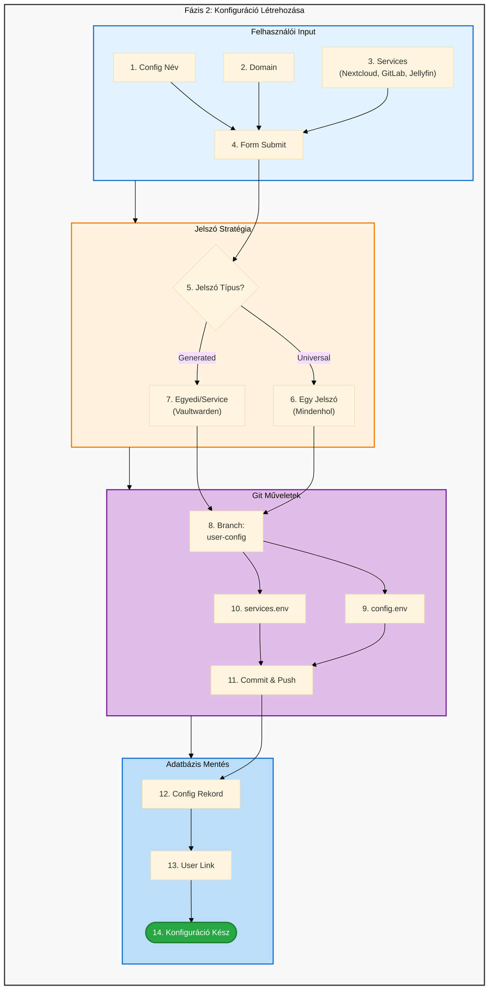

# Fázis 2: Konfiguráció Létrehozása

```mermaid
%%{init: {"theme": "base", "themeVariables": { "fontSize": "14px"}}}%%
flowchart LR

    subgraph PHASE2_CONFIG ["Fázis 2: Konfiguráció Létrehozása"]
        direction TB

        subgraph USER_INPUT ["Felhasználói Input"]
            direction TB
            P1["1. Config Név"] --> P4
            P2["2. Domain"] --> P4
            P3["3. Services<br/>(Nextcloud, GitLab, Jellyfin)"] --> P4
            P4["4. Form Submit"]
        end

        subgraph PASSWORD_STRATEGY ["Jelszó Stratégia"]
            direction TB
            P5{5. Jelszó Típus?}
            P5 -->|Universal| P6["6. Egy Jelszó<br/>(Mindenhol)"]
            P5 -->|Generated| P7["7. Egyedi/Service<br/>(Vaultwarden)"]
        end

        subgraph GITOPS_OPS ["Git Műveletek"]
            direction TB
            P8["8. Branch:<br/>user-config"]
            P9["9. config.env"]
            P10["10. services.env"]
            P8 --> P9
            P8 --> P10
            P9 & P10 --> P11["11. Commit & Push"]
        end

        subgraph DB_PERSISTENCE ["Adatbázis Mentés"]
            direction TB
            P12["12. Config Rekord"] --> P13["13. User Link"]
            P13 --> P14(["14. Konfiguráció Kész"])
        end

        USER_INPUT --> PASSWORD_STRATEGY
        PASSWORD_STRATEGY --> GITOPS_OPS
        GITOPS_OPS --> DB_PERSISTENCE

        P4 --> P5
        P6 & P7 --> P8
        P11 --> P12
    end

    %% --- STYLING ---
    style PHASE2_CONFIG fill:#f9f9f9,stroke:#333,stroke-width:2px
    style USER_INPUT fill:#e3f2fd,stroke:#1976d2,stroke-width:2px
    style PASSWORD_STRATEGY fill:#fff3e0,stroke:#f57c00,stroke-width:2px
    style GITOPS_OPS fill:#e1bee7,stroke:#7b1fa2,stroke-width:2px
    style DB_PERSISTENCE fill:#bbdefb,stroke:#1976d2,stroke-width:2px

    style P14 fill:#28a745,stroke:#1e7e34,color:#ffffff,stroke-width:2px
```
