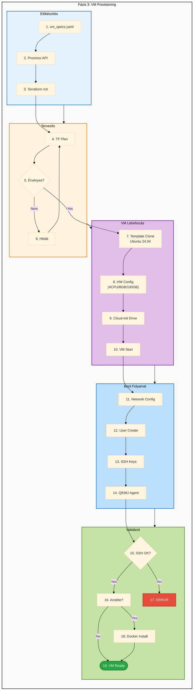

# Fázis 3: VM Provisioning

```mermaid
%%{init: {"theme": "base", "themeVariables": { "fontSize": "14px"}}}%%
flowchart LR

    subgraph PHASE3_VM_PROVISIONING ["Fázis 3: VM Provisioning"]
        direction TB

        subgraph PREPARATION ["Előkészítés"]
            direction TB
            P1["1. vm_specs.yaml"] --> P2["2. Proxmox API"]
            P2 --> P3["3. Terraform Init"]
        end

        subgraph PLANNING ["Tervezés"]
            direction TB
            P4["4. TF Plan"] --> P5{5. Érvényes?}
            P5 -->|Nem| P6["6. Hibák"]
            P6 --> P4
        end

        subgraph CREATION ["VM Létrehozás"]
            direction TB
            P7["7. Template Clone<br/>Ubuntu 24.04"] --> P8["8. HW Config<br/>(4CPU/8GB/100GB)"]
            P8 --> P9["9. Cloud-init Drive"]
            P9 --> P10["10. VM Start"]
        end

        subgraph BOOT_PROCESS ["Boot Folyamat"]
            direction TB
            P11["11. Network Config"] --> P12["12. User Create"]
            P12 --> P13["13. SSH Keys"]
            P13 --> P14["14. QEMU Agent"]
        end

        subgraph VALIDATION ["Validáció"]
            direction TB
            P15{15. SSH OK?}
            P15 -->|Yes| P16["16. Ansible?"]
            P15 -->|No| P17["17. ERROR"]
            P16 -->|Yes| P18["18. Docker Install"]
            P16 -->|No| P19(["19. VM Ready"])
            P18 --> P19
        end

        PREPARATION --> PLANNING
        PLANNING --> CREATION
        CREATION --> BOOT_PROCESS
        BOOT_PROCESS --> VALIDATION

        P3 --> P4
        P5 -->|Yes| P7
        P10 --> P11
        P14 --> P15

    end

    %% --- STYLING ---
    style PHASE3_VM_PROVISIONING fill:#f9f9f9,stroke:#333,stroke-width:2px
    style PREPARATION fill:#e3f2fd,stroke:#1976d2,stroke-width:2px
    style PLANNING fill:#fff3e0,stroke:#f57c00,stroke-width:2px
    style CREATION fill:#e1bee7,stroke:#7b1fa2,stroke-width:2px
    style BOOT_PROCESS fill:#bbdefb,stroke:#1976d2,stroke-width:2px
    style VALIDATION fill:#c5e1a5,stroke:#558b2f,stroke-width:2px

    style P19 fill:#28a745,stroke:#1e7e34,color:#ffffff,stroke-width:2px
    style P17 fill:#e74c3c,stroke:#c0392b,color:#ffffff,stroke-width:2px
```
