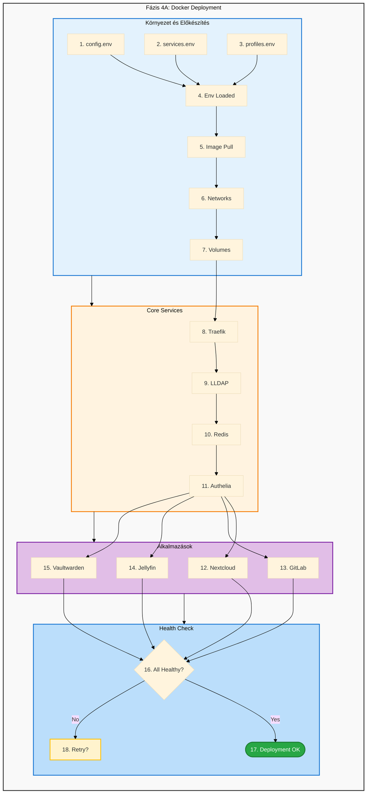

# Fázis 4A: Docker Deployment

```mermaid
%%{init: {"theme": "base", "themeVariables": { "fontSize": "14px"}}}%%
flowchart LR

    subgraph PHASE4A_DOCKER ["Fázis 4A: Docker Deployment"]
        direction TB

        subgraph ENVIRONMENT_SETUP ["Környezet és Előkészítés"]
            direction TB
            P1["1. config.env"] --> P4
            P2["2. services.env"] --> P4
            P3["3. profiles.env"] --> P4
            P4["4. Env Loaded"]
            P4 --> P5["5. Image Pull"]
            P5 --> P6["6. Networks"]
            P6 --> P7["7. Volumes"]
        end

        subgraph CORE_SERVICES_START ["Core Services"]
            direction TB
            P8["8. Traefik"] --> P9["9. LLDAP"]
            P9 --> P10["10. Redis"]
            P10 --> P11["11. Authelia"]
        end

        subgraph APPLICATION_START ["Alkalmazások"]
            direction TB
            P12["12. Nextcloud"]
            P13["13. GitLab"]
            P14["14. Jellyfin"]
            P15["15. Vaultwarden"]
        end

        subgraph HEALTH_CHECK ["Health Check"]
            direction TB
            P16{16. All Healthy?}
            P16 -->|Yes| P17(["17. Deployment OK"])
            P16 -->|No| P18["18. Retry?"]
        end

        ENVIRONMENT_SETUP --> CORE_SERVICES_START
        CORE_SERVICES_START --> APPLICATION_START
        APPLICATION_START --> HEALTH_CHECK

        P7 --> P8
        P11 --> P12 & P13 & P14 & P15
        P12 & P13 & P14 & P15 --> P16

    end

    %% --- STYLING ---
    style PHASE4A_DOCKER fill:#f9f9f9,stroke:#333,stroke-width:2px
    style ENVIRONMENT_SETUP fill:#e3f2fd,stroke:#1976d2,stroke-width:2px
    style CORE_SERVICES_START fill:#fff3e0,stroke:#f57c00,stroke-width:2px
    style APPLICATION_START fill:#e1bee7,stroke:#7b1fa2,stroke-width:2px
    style HEALTH_CHECK fill:#bbdefb,stroke:#1976d2,stroke-width:2px

    style P17 fill:#28a745,stroke:#1e7e34,color:#ffffff,stroke-width:2px
    style P18 fill:#fff3cd,stroke:#ffc107,stroke-width:2px
```
