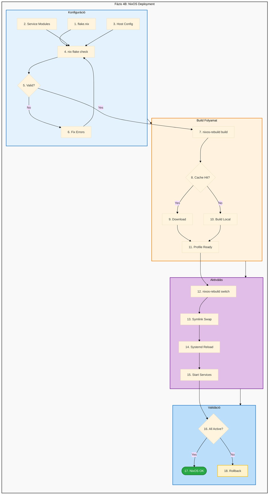

# Fázis 4B: NixOS Deployment

```mermaid
%%{init: {"theme": "base", "themeVariables": { "fontSize": "14px"}}}%%
flowchart LR

    subgraph PHASE4B_NIXOS ["Fázis 4B: NixOS Deployment"]
        direction TB

        subgraph CONFIGURATION ["Konfiguráció"]
            direction TB
            P1["1. flake.nix"] --> P4
            P2["2. Service Modules"] --> P4
            P3["3. Host Config"] --> P4
            P4["4. nix flake check"] --> P5{5. Valid?}
            P5 -->|No| P6["6. Fix Errors"]
            P6 --> P4
        end

        subgraph BUILD_PROCESS ["Build Folyamat"]
            direction TB
            P7["7. nixos-rebuild build"] --> P8{8. Cache Hit?}
            P8 -->|Yes| P9["9. Download"]
            P8 -->|No| P10["10. Build Local"]
            P9 & P10 --> P11["11. Profile Ready"]
        end

        subgraph ACTIVATION ["Aktiválás"]
            direction TB
            P12["12. nixos-rebuild switch"] --> P13["13. Symlink Swap"]
            P13 --> P14["14. Systemd Reload"]
            P14 --> P15["15. Start Services"]
        end

        subgraph VALIDATION ["Validáció"]
            direction TB
            P16{16. All Active?}
            P16 -->|Yes| P17(["17. NixOS OK"])
            P16 -->|No| P18["18. Rollback"]
        end

        CONFIGURATION --> BUILD_PROCESS
        BUILD_PROCESS --> ACTIVATION
        ACTIVATION --> VALIDATION

        P5 -->|Yes| P7
        P11 --> P12
        P15 --> P16

    end

    %% --- STYLING ---
    style PHASE4B_NIXOS fill:#f9f9f9,stroke:#333,stroke-width:2px
    style CONFIGURATION fill:#e3f2fd,stroke:#1976d2,stroke-width:2px
    style BUILD_PROCESS fill:#fff3e0,stroke:#f57c00,stroke-width:2px
    style ACTIVATION fill:#e1bee7,stroke:#7b1fa2,stroke-width:2px
    style VALIDATION fill:#bbdefb,stroke:#1976d2,stroke-width:2px

    style P17 fill:#28a745,stroke:#1e7e34,color:#ffffff,stroke-width:2px
    style P18 fill:#fff3cd,stroke:#ffc107,stroke-width:2px
```
