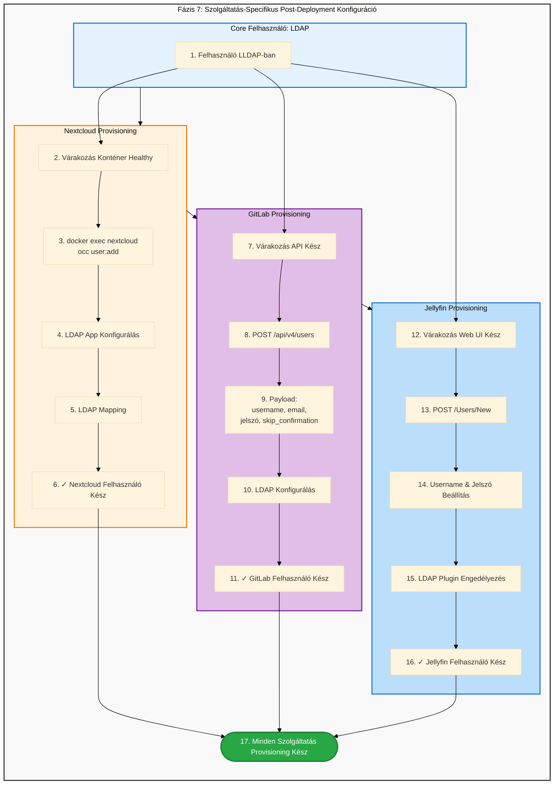

# Fázis 7: Szolgáltatás-Specifikus Post-Deployment Konfiguráció

```mermaid
%%{init: {"theme": "base", "themeVariables": { "fontSize": "14px"}}}%%
flowchart LR

    subgraph PHASE7_SERVICE_PROVISIONING ["Fázis 7: Szolgáltatás-Specifikus Post-Deployment Konfiguráció"]
        direction TB

        subgraph CORE_USER ["Core Felhasználó: LDAP"]
            direction TB
            P1["1. Felhasználó LLDAP-ban"]
        end

        subgraph NEXTCLOUD_PROVISIONING ["Nextcloud Provisioning"]
            direction TB
            P2["2. Várakozás Konténer Healthy"] --> P3["3. docker exec nextcloud<br/>occ user:add"]
            P3 --> P4["4. LDAP App Konfigurálás"]
            P4 --> P5["5. LDAP Mapping"]
            P5 --> P6["6. ✓ Nextcloud Felhasználó Kész"]
        end

        subgraph GITLAB_PROVISIONING ["GitLab Provisioning"]
            direction TB
            P7["7. Várakozás API Kész"] --> P8["8. POST /api/v4/users"]
            P8 --> P9["9. Payload:<br/>username, email,<br/>jelszó, skip_confirmation"]
            P9 --> P10["10. LDAP Konfigurálás"]
            P10 --> P11["11. ✓ GitLab Felhasználó Kész"]
        end

        subgraph JELLYFIN_PROVISIONING ["Jellyfin Provisioning"]
            direction TB
            P12["12. Várakozás Web UI Kész"] --> P13["13. POST /Users/New"]
            P13 --> P14["14. Username & Jelszó Beállítás"]
            P14 --> P15["15. LDAP Plugin Engedélyezés"]
            P15 --> P16["16. ✓ Jellyfin Felhasználó Kész"]
        end
        
        CORE_USER --> NEXTCLOUD_PROVISIONING
        NEXTCLOUD_PROVISIONING --> GITLAB_PROVISIONING
        GITLAB_PROVISIONING --> JELLYFIN_PROVISIONING

        P1 --> P2
        P1 --> P7
        P1 --> P12

        P6 & P11 & P16 --> P17(["17. Minden Szolgáltatás Provisioning Kész"])
    end

    %% --- STYLING ---
    style PHASE7_SERVICE_PROVISIONING fill:#f9f9f9,stroke:#333,stroke-width:2px
    style CORE_USER fill:#e3f2fd,stroke:#1976d2,stroke-width:2px
    style NEXTCLOUD_PROVISIONING fill:#fff3e0,stroke:#f57c00,stroke-width:2px
    style GITLAB_PROVISIONING fill:#e1bee7,stroke:#7b1fa2,stroke-width:2px
    style JELLYFIN_PROVISIONING fill:#bbdefb,stroke:#1976d2,stroke-width:2px

    style P17 fill:#28a745,stroke:#1e7e34,color:#ffffff,stroke-width:2px
```
