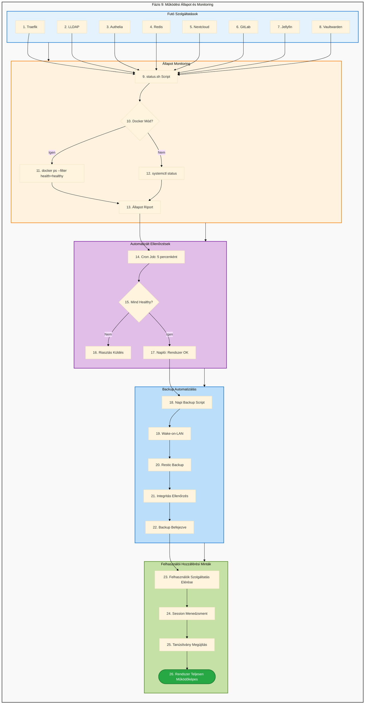

# Fázis 9: Működési Állapot és Monitoring

```mermaid
%%{init: {"theme": "base", "themeVariables": { "fontSize": "14px"}}}%%
flowchart LR

    subgraph PHASE9_MONITORING ["Fázis 9: Működési Állapot és Monitoring"]
        direction TB

        subgraph RUNNING_SERVICES ["Futó Szolgáltatások"]
            direction TB
            P1["1. Traefik"]
            P2["2. LLDAP"]
            P3["3. Authelia"]
            P4["4. Redis"]
            P5["5. Nextcloud"]
            P6["6. GitLab"]
            P7["7. Jellyfin"]
            P8["8. Vaultwarden"]
        end

        subgraph STATUS_MONITORING ["Állapot Monitoring"]
            direction TB
            P9["9. status.sh Script"] --> P10{10. Docker Mód?}
            P10 -->|Igen| P11["11. docker ps --filter health=healthy"]
            P10 -->|Nem| P12["12. systemctl status"]
            P11 & P12 --> P13["13. Állapot Riport"]
        end

        subgraph AUTOMATED_CHECKS ["Automatizált Ellenőrzések"]
            direction TB
            P14["14. Cron Job: 5 percenként"] --> P15{15. Mind Healthy?}
            P15 -->|Nem| P16["16. Riasztás Küldés"]
            P15 -->|Igen| P17["17. Napló: Rendszer OK"]
        end

        subgraph BACKUP_AUTOMATION ["Backup Automatizálás"]
            direction TB
            P18["18. Napi Backup Script"] --> P19["19. Wake-on-LAN"]
            P19 --> P20["20. Restic Backup"]
            P20 --> P21["21. Integritás Ellenőrzés"]
            P21 --> P22["22. Backup Befejezve"]
        end

        subgraph ACCESS_PATTERNS ["Felhasználói Hozzáférési Minták"]
            direction TB
            P23["23. Felhasználók Szolgáltatás Elérése"] --> P24["24. Session Menedzsment"]
            P24 --> P25["25. Tanúsítvány Megújítás"]
            P25 --> P26(["26. Rendszer Teljesen Működőképes"])
        end

        RUNNING_SERVICES --> STATUS_MONITORING
        STATUS_MONITORING --> AUTOMATED_CHECKS
        AUTOMATED_CHECKS --> BACKUP_AUTOMATION
        BACKUP_AUTOMATION --> ACCESS_PATTERNS

        P1 & P2 & P3 & P4 & P5 & P6 & P7 & P8 --> P9
        P13 --> P14
        P17 --> P18
        P22 --> P23
    end

    %% --- STYLING ---
    style PHASE9_MONITORING fill:#f9f9f9,stroke:#333,stroke-width:2px
    style RUNNING_SERVICES fill:#e3f2fd,stroke:#1976d2,stroke-width:2px
    style STATUS_MONITORING fill:#fff3e0,stroke:#f57c00,stroke-width:2px
    style AUTOMATED_CHECKS fill:#e1bee7,stroke:#7b1fa2,stroke-width:2px
    style BACKUP_AUTOMATION fill:#bbdefb,stroke:#1976d2,stroke-width:2px
    style ACCESS_PATTERNS fill:#c5e1a5,stroke:#558b2f,stroke-width:2px

    style P26 fill:#28a745,stroke:#1e7e34,color:#ffffff,stroke-width:2px
```
