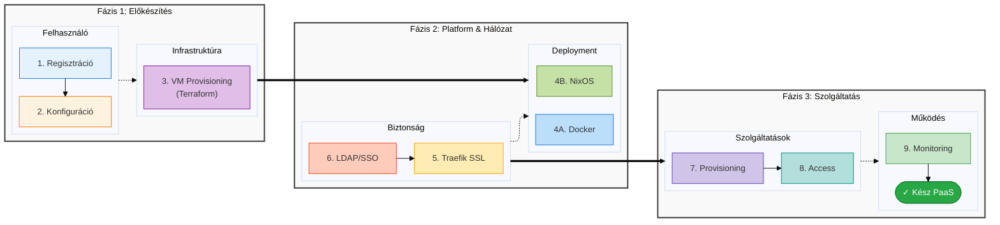

# Összefoglaló: Teljes Folyamat

```mermaid
%%{init: {"flowchart": {"defaultRenderer": "elk", "nodeSpacing": 80, "rankSpacing": 80}, "theme": "base", "themeVariables": { "fontSize": "14px"}}}%%
flowchart LR
    %% --- ROW 1: LEFT TO RIGHT (LR) ---
    subgraph PHASE1 [Fázis 1: Előkészítés]
        direction LR
        subgraph USER[Felhasználó]
            direction TB
            P1["1. Regisztráció"] --> P2["2. Konfiguráció"]
        end

        subgraph INFRA[Infrastruktúra]
            direction TB
            P3["3. VM Provisioning<br/>(Terraform)"]
        end
        
        USER -.-> INFRA
    end

    %% --- ROW 2: RIGHT TO LEFT (RL) ---
    subgraph PHASE2 [Fázis 2: Platform & Hálózat]
        direction RL
        
        subgraph NETWORK[Biztonság]
            direction TB
            P6["6. LDAP/SSO"] --> P5["5. Traefik SSL"]
        end
        
        subgraph DEPLOY[Deployment]
            direction TB
            P4B["4B. NixOS"]
            P4A["4A. Docker"]
        end
        
        NETWORK -.-> DEPLOY
    end

    %% --- ROW 3: LEFT TO RIGHT (LR) ---
    subgraph PHASE3 [Fázis 3: Szolgáltatás]
        direction LR
        
        subgraph SERVICES[Szolgáltatások]
            direction TB
            P7["7. Provisioning"] --> P8["8. Access"]
        end
        
        subgraph OPS[Működés]
            direction TB
            P9["9. Monitoring"] --> FINAL(["✓ Kész PaaS"])
        end
        
        SERVICES -.-> OPS
    end

    %% --- SNAKE CONNECTIONS BETWEEN ROWS ---
    INFRA ==> DEPLOY
    NETWORK ==> SERVICES
    


    %% --- STYLING ---
    style PHASE1 fill:#f9f9f9,stroke:#333,stroke-width:2px
    style PHASE2 fill:#f9f9f9,stroke:#333,stroke-width:2px
    style PHASE3 fill:#f9f9f9,stroke:#333,stroke-width:2px

    style P1 fill:#e3f2fd,stroke:#1976d2
    style P2 fill:#fff3e0,stroke:#f57c00
    style P3 fill:#e1bee7,stroke:#7b1fa2
    style P4A fill:#bbdefb,stroke:#1976d2
    style P4B fill:#c5e1a5,stroke:#558b2f
    style P5 fill:#ffecb3,stroke:#ffa000
    style P6 fill:#ffccbc,stroke:#e64a19
    style P7 fill:#d1c4e9,stroke:#5e35b1
    style P8 fill:#b2dfdb,stroke:#00897b
    style P9 fill:#c8e6c9,stroke:#43a047
    style FINAL fill:#28a745,stroke:#1e7e34,color:white
```
