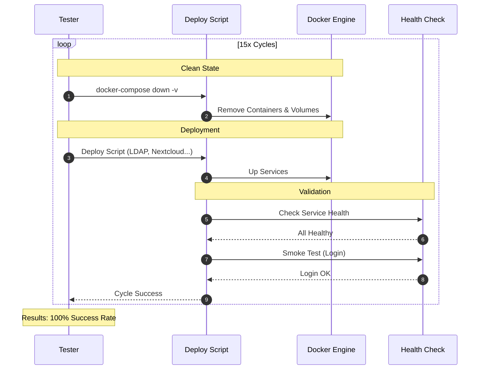

# Sequence Diagram: Docker Deployment Benchmark

```mermaid
sequenceDiagram
    autonumber
    participant U as Tester
    participant S as Deploy Script
    participant D as Docker Engine
    participant H as Health Check

    loop 15x Cycles
        Note over U,D: Clean State
        U->>S: docker-compose down -v
        S->>D: Remove Containers & Volumes

        Note over U,D: Deployment
        U->>S: Deploy Script (LDAP, Nextcloud...)
        S->>D: Up Services

        Note over S,H: Validation
        S->>H: Check Service Health
        H-->>S: All Healthy
        S->>H: Smoke Test (Login)
        H-->>S: Login OK
        
        S-->>U: Cycle Success
    end

    Note over U: Results: 100% Success Rate
```
