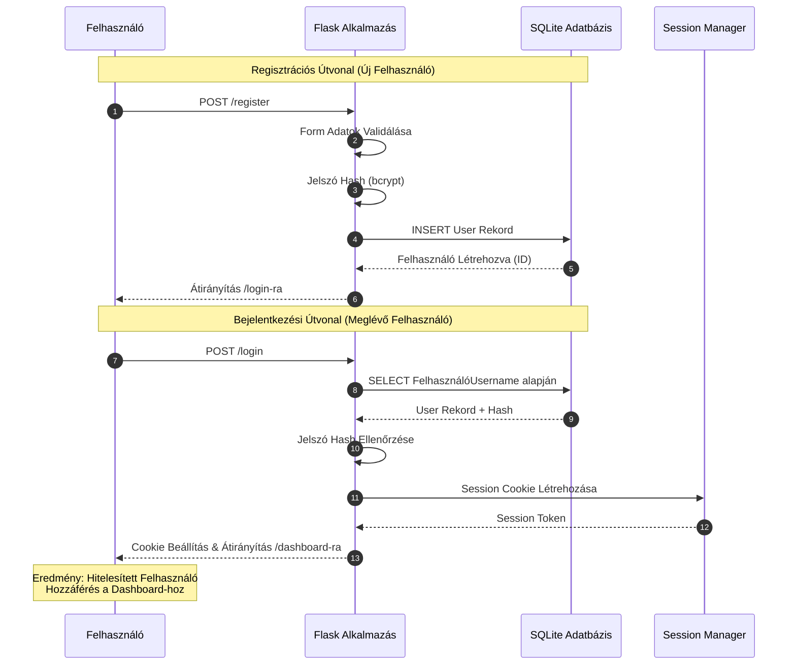

# Sequence Diagram: Phase 1 User Onboarding

```mermaid
sequenceDiagram
    autonumber
    participant U as Felhasználó
    participant F as Flask Alkalmazás
    participant DB as SQLite Adatbázis
    participant S as Session Manager

    Note over U,DB: Regisztrációs Útvonal (Új Felhasználó)
    U->>F: POST /register
    F->>F: Form Adatok Validálása
    F->>F: Jelszó Hash (bcrypt)
    F->>DB: INSERT User Rekord
    DB-->>F: Felhasználó Létrehozva (ID)
    F-->>U: Átirányítás /login-ra

    Note over U,DB: Bejelentkezési Útvonal (Meglévő Felhasználó)
    U->>F: POST /login
    F->>DB: SELECT FelhasználóUsername alapján
    DB-->>F: User Rekord + Hash
    F->>F: Jelszó Hash Ellenőrzése
    F->>S: Session Cookie Létrehozása
    S-->>F: Session Token
    F-->>U: Cookie Beállítás & Átirányítás /dashboard-ra

    Note over U: Eredmény: Hitelesített Felhasználó<br/>Hozzáférés a Dashboard-hoz
```
