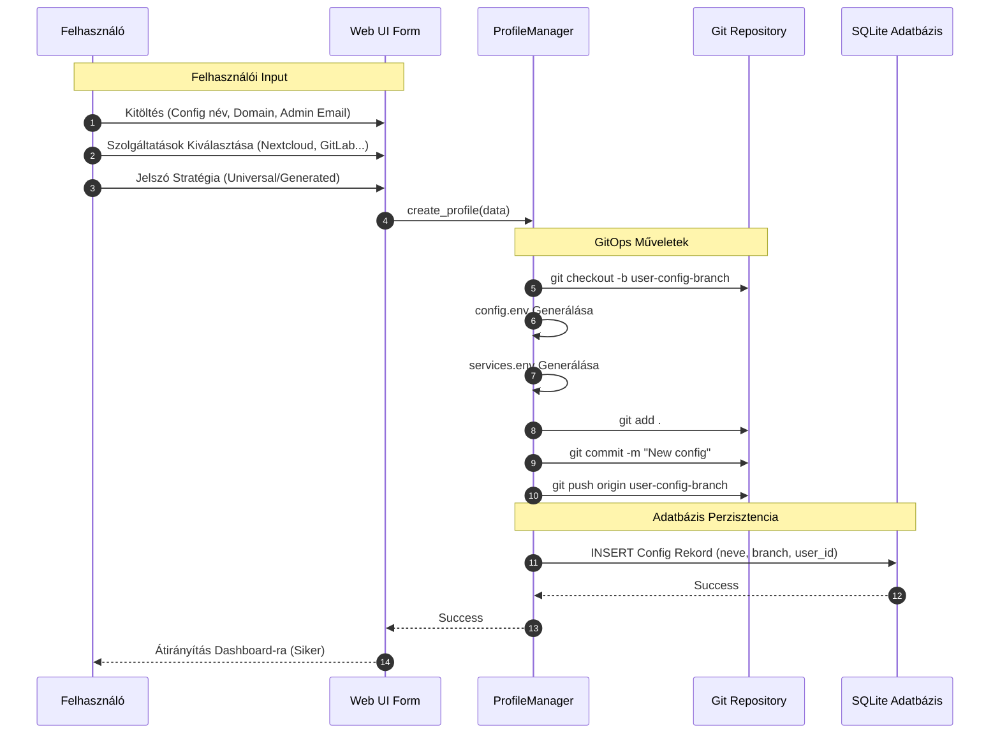

# Sequence Diagram: Phase 2 Configuration Creation

```mermaid
sequenceDiagram
    autonumber
    participant U as Felhasználó
    participant GUI as Web UI Form
    participant PM as ProfileManager
    participant GIT as Git Repository
    participant DB as SQLite Adatbázis

    Note over U,GUI: Felhasználói Input
    U->>GUI: Kitöltés (Config név, Domain, Admin Email)
    U->>GUI: Szolgáltatások Kiválasztása (Nextcloud, GitLab...)
    U->>GUI: Jelszó Stratégia (Universal/Generated)
    GUI->>PM: create_profile(data)

    Note over PM,GIT: GitOps Műveletek
    PM->>GIT: git checkout -b user-config-branch
    PM->>PM: config.env Generálása
    PM->>PM: services.env Generálása
    PM->>GIT: git add .
    PM->>GIT: git commit -m "New config"
    PM->>GIT: git push origin user-config-branch

    Note over PM,DB: Adatbázis Perzisztencia
    PM->>DB: INSERT Config Rekord (neve, branch, user_id)
    DB-->>PM: Success
    PM-->>GUI: Success
    GUI-->>U: Átirányítás Dashboard-ra (Siker)
```
