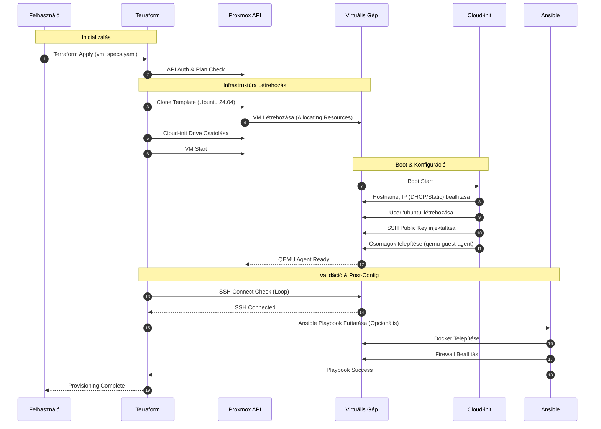

# Sequence Diagram: Phase 3 VM Provisioning

```mermaid
sequenceDiagram
    autonumber
    participant U as Felhasználó
    participant TF as Terraform
    participant PMX as Proxmox API
    participant VM as Virtuális Gép
    participant CI as Cloud-init
    participant ANS as Ansible

    Note over U,TF: Inicializálás
    U->>TF: Terraform Apply (vm_specs.yaml)
    TF->>PMX: API Auth & Plan Check

    Note over TF,VM: Infrastruktúra Létrehozás
    TF->>PMX: Clone Template (Ubuntu 24.04)
    PMX->>VM: VM Létrehozása (Allocating Resources)
    TF->>PMX: Cloud-init Drive Csatolása
    TF->>PMX: VM Start

    Note over VM,CI: Boot & Konfiguráció
    VM->>CI: Boot Start
    CI->>VM: Hostname, IP (DHCP/Static) beállítása
    CI->>VM: User 'ubuntu' létrehozása
    CI->>VM: SSH Public Key injektálása
    CI->>VM: Csomagok telepítése (qemu-guest-agent)
    VM-->>PMX: QEMU Agent Ready

    Note over TF,ANS: Validáció & Post-Config
    TF->>VM: SSH Connect Check (Loop)
    VM-->>TF: SSH Connected
    TF->>ANS: Ansible Playbook Futtatása (Opcionális)
    ANS->>VM: Docker Telepítése
    ANS->>VM: Firewall Beállítás
    ANS-->>TF: Playbook Success
    TF-->>U: Provisioning Complete
```
