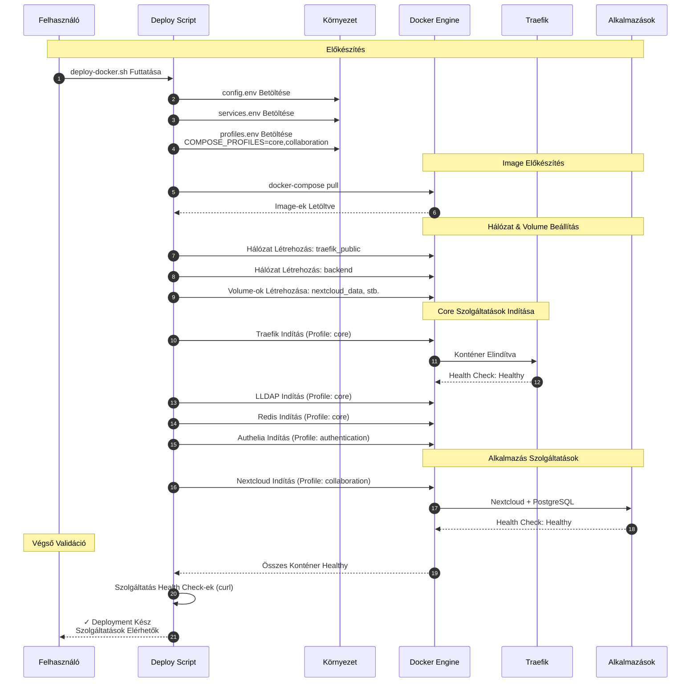

# Sequence Diagram: Phase 4A Docker Deployment

```mermaid
sequenceDiagram
    autonumber
    participant U as Felhasználó
    participant S as Deploy Script
    participant E as Környezet
    participant D as Docker Engine
    participant T as Traefik
    participant A as Alkalmazások

    Note over U,A: Előkészítés
    U->>S: deploy-docker.sh Futtatása
    S->>E: config.env Betöltése
    S->>E: services.env Betöltése
    S->>E: profiles.env Betöltése<br/>COMPOSE_PROFILES=core,collaboration

    Note over D,A: Image Előkészítés
    S->>D: docker-compose pull
    D-->>S: Image-ek Letöltve

    Note over D,A: Hálózat & Volume Beállítás
    S->>D: Hálózat Létrehozás: traefik_public
    S->>D: Hálózat Létrehozás: backend
    S->>D: Volume-ok Létrehozása: nextcloud_data, stb.

    Note over D,T: Core Szolgáltatások Indítása
    S->>D: Traefik Indítás (Profile: core)
    D->>T: Konténer Elindítva
    T-->>D: Health Check: Healthy

    S->>D: LLDAP Indítás (Profile: core)
    S->>D: Redis Indítás (Profile: core)
    S->>D: Authelia Indítás (Profile: authentication)

    Note over D,A: Alkalmazás Szolgáltatások
    S->>D: Nextcloud Indítás (Profile: collaboration)
    D->>A: Nextcloud + PostgreSQL
    A-->>D: Health Check: Healthy

    Note over U: Végső Validáció
    D-->>S: Összes Konténer Healthy
    S->>S: Szolgáltatás Health Check-ek (curl)
    S-->>U: ✓ Deployment Kész<br/>Szolgáltatások Elérhetők
```
