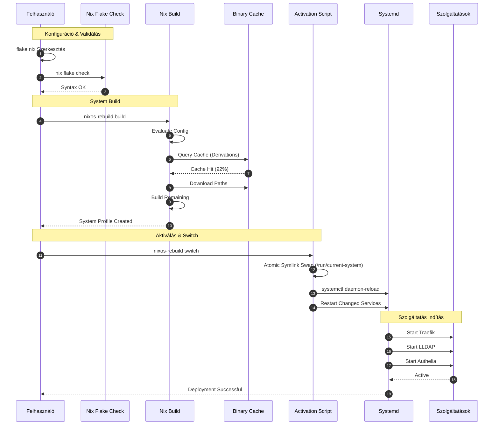

# Sequence Diagram: Phase 4B NixOS Deployment

```mermaid
sequenceDiagram
    autonumber
    participant U as Felhasználó
    participant NIX as Nix Flake Check
    participant BLD as Nix Build
    participant CCH as Binary Cache
    participant ACT as Activation Script
    participant SYS as Systemd
    participant SRV as Szolgáltatások

    Note over U,NIX: Konfiguráció & Validálás
    U->>U: flake.nix Szerkesztés
    U->>NIX: nix flake check
    NIX-->>U: Syntax OK

    Note over U,BLD: System Build
    U->>BLD: nixos-rebuild build
    BLD->>BLD: Evaluate Config
    BLD->>CCH: Query Cache (Derivations)
    CCH-->>BLD: Cache Hit (92%)
    BLD->>CCH: Download Paths
    BLD->>BLD: Build Remaining
    BLD-->>U: System Profile Created

    Note over U,ACT: Aktiválás & Switch
    U->>ACT: nixos-rebuild switch
    ACT->>ACT: Atomic Symlink Swap (/run/current-system)
    ACT->>SYS: systemctl daemon-reload
    ACT->>SYS: Restart Changed Services

    Note over SYS,SRV: Szolgáltatás Indítás
    SYS->>SRV: Start Traefik
    SYS->>SRV: Start LLDAP
    SYS->>SRV: Start Authelia
    SRV-->>SYS: Active
    SYS-->>U: Deployment Successful
```
