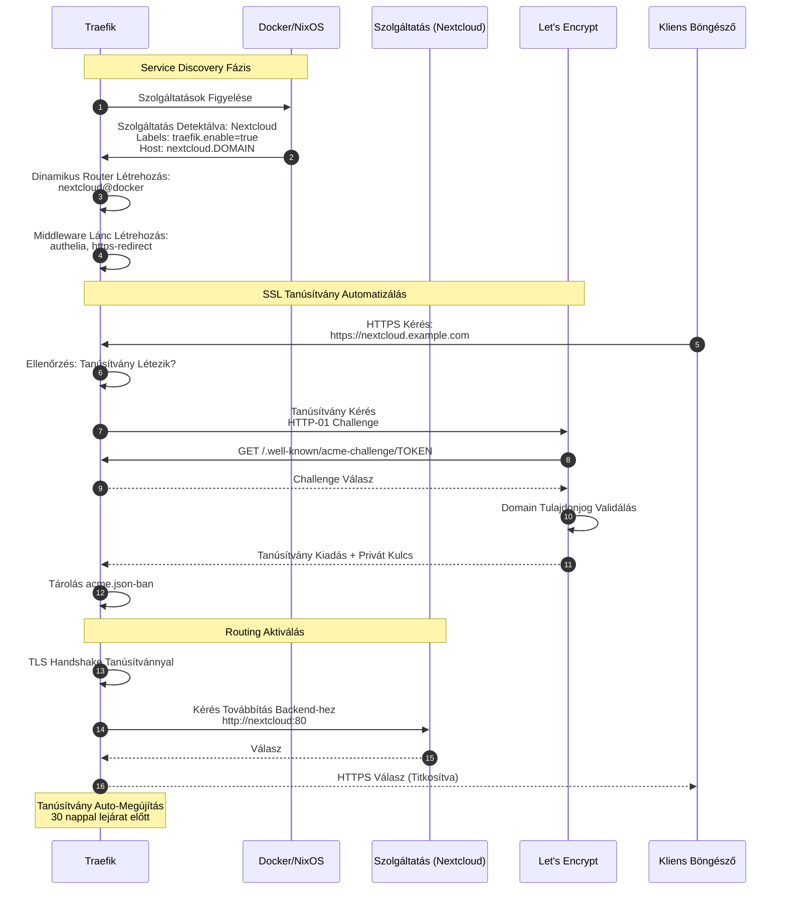

# Sequence Diagram: Phase 5 Traefik SSL

```mermaid
sequenceDiagram
    autonumber
    participant T as Traefik
    participant D as Docker/NixOS
    participant S as Szolgáltatás (Nextcloud)
    participant LE as Let's Encrypt
    participant C as Kliens Böngésző

    Note over T,D: Service Discovery Fázis
    T->>D: Szolgáltatások Figyelése
    D->>T: Szolgáltatás Detektálva: Nextcloud<br/>Labels: traefik.enable=true<br/>Host: nextcloud.DOMAIN
    T->>T: Dinamikus Router Létrehozás:<br/>nextcloud@docker
    T->>T: Middleware Lánc Létrehozás:<br/>authelia, https-redirect

    Note over T,LE: SSL Tanúsítvány Automatizálás
    C->>T: HTTPS Kérés:<br/>https://nextcloud.example.com
    T->>T: Ellenőrzés: Tanúsítvány Létezik?
    T->>LE: Tanúsítvány Kérés<br/>HTTP-01 Challenge
    LE->>T: GET /.well-known/acme-challenge/TOKEN
    T-->>LE: Challenge Válasz
    LE->>LE: Domain Tulajdonjog Validálás
    LE-->>T: Tanúsítvány Kiadás + Privát Kulcs
    T->>T: Tárolás acme.json-ban

    Note over T,S: Routing Aktiválás
    T->>T: TLS Handshake Tanúsítvánnyal
    T->>S: Kérés Továbbítás Backend-hez<br/>http://nextcloud:80
    S-->>T: Válasz
    T-->>C: HTTPS Válasz (Titkosítva)

    Note over T: Tanúsítvány Auto-Megújítás<br/>30 nappal lejárat előtt
```
