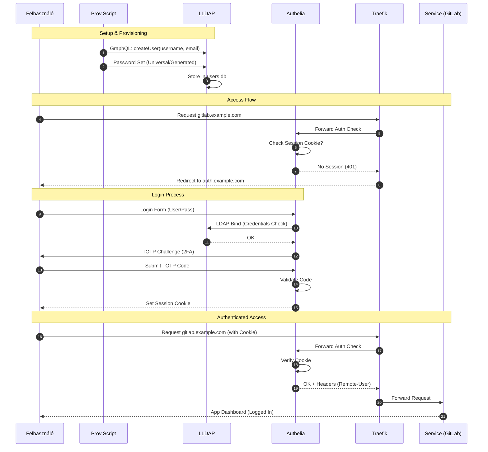

# Sequence Diagram: Phase 6 LDAP SSO

```mermaid
sequenceDiagram
    autonumber
    participant U as Felhasználó
    participant P as Prov Script
    participant L as LLDAP
    participant A as Authelia
    participant T as Traefik
    participant S as Service (GitLab)

    Note over U,L: Setup & Provisioning
    P->>L: GraphQL: createUser(username, email)
    P->>L: Password Set (Universal/Generated)
    L->>L: Store in users.db

    Note over U,S: Access Flow
    U->>T: Request gitlab.example.com
    T->>A: Forward Auth Check
    A->>A: Check Session Cookie?
    A-->>T: No Session (401)
    T-->>U: Redirect to auth.example.com

    Note over U,A: Login Process
    U->>A: Login Form (User/Pass)
    A->>L: LDAP Bind (Credentials Check)
    L-->>A: OK
    A->>U: TOTP Challenge (2FA)
    U->>A: Submit TOTP Code
    A->>A: Validate Code
    A-->>U: Set Session Cookie

    Note over U,S: Authenticated Access
    U->>T: Request gitlab.example.com (with Cookie)
    T->>A: Forward Auth Check
    A->>A: Verify Cookie
    A-->>T: OK + Headers (Remote-User)
    T->>S: Forward Request
    S-->>U: App Dashboard (Logged In)
```
