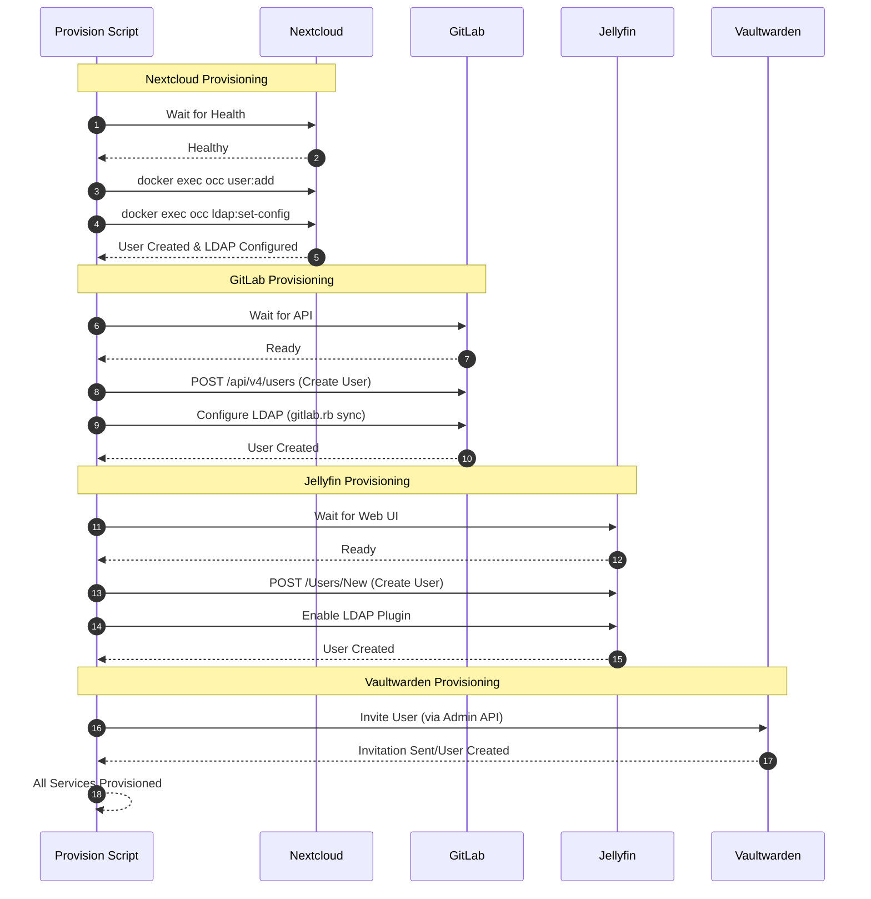

# Sequence Diagram: Phase 7 Service Provisioning

```mermaid
sequenceDiagram
    autonumber
    participant S as Provision Script
    participant NC as Nextcloud
    participant GL as GitLab
    participant JF as Jellyfin
    participant VW as Vaultwarden

    Note over S,NC: Nextcloud Provisioning
    S->>NC: Wait for Health
    NC-->>S: Healthy
    S->>NC: docker exec occ user:add
    S->>NC: docker exec occ ldap:set-config
    NC-->>S: User Created & LDAP Configured

    Note over S,GL: GitLab Provisioning
    S->>GL: Wait for API
    GL-->>S: Ready
    S->>GL: POST /api/v4/users (Create User)
    S->>GL: Configure LDAP (gitlab.rb sync)
    GL-->>S: User Created

    Note over S,JF: Jellyfin Provisioning
    S->>JF: Wait for Web UI
    JF-->>S: Ready
    S->>JF: POST /Users/New (Create User)
    S->>JF: Enable LDAP Plugin
    JF-->>S: User Created

    Note over S,VW: Vaultwarden Provisioning
    S->>VW: Invite User (via Admin API)
    VW-->>S: Invitation Sent/User Created
    
    S-->>S: All Services Provisioned
```
