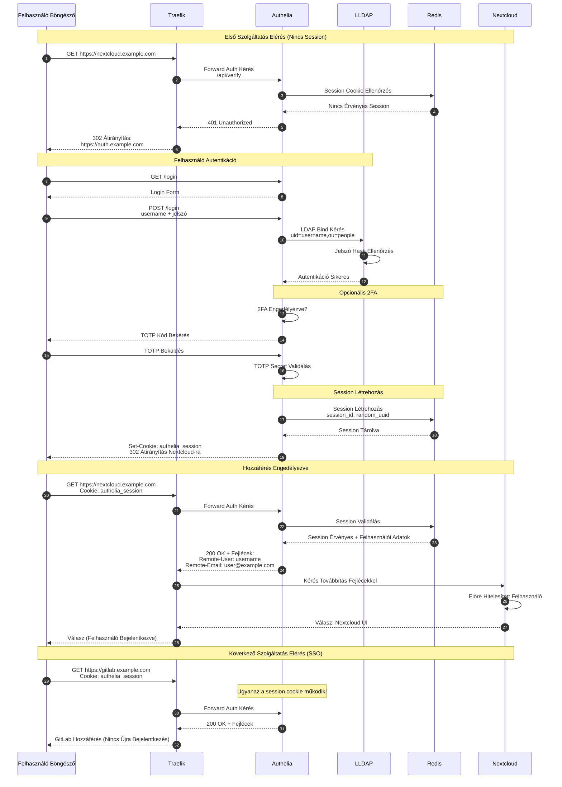

# Sequence Diagram: Phase 8 User Access SSO

```mermaid
sequenceDiagram
    autonumber
    participant U as Felhasználó Böngésző
    participant T as Traefik
    participant A as Authelia
    participant L as LLDAP
    participant R as Redis
    participant N as Nextcloud

    Note over U,N: Első Szolgáltatás Elérés (Nincs Session)
    U->>T: GET https://nextcloud.example.com
    T->>A: Forward Auth Kérés<br/>/api/verify
    A->>R: Session Cookie Ellenőrzés
    R-->>A: Nincs Érvényes Session
    A-->>T: 401 Unauthorized
    T-->>U: 302 Átirányítás:<br/>https://auth.example.com

    Note over U,L: Felhasználó Autentikáció
    U->>A: GET /login
    A-->>U: Login Form
    U->>A: POST /login<br/>username + jelszó
    A->>L: LDAP Bind Kérés<br/>uid=username,ou=people
    L->>L: Jelszó Hash Ellenőrzés
    L-->>A: Autentikáció Sikeres

    Note over A,R: Opcionális 2FA
    A->>A: 2FA Engedélyezve?
    A-->>U: TOTP Kód Bekérés
    U->>A: TOTP Beküldés
    A->>A: TOTP Secret Validálás

    Note over A,R: Session Létrehozás
    A->>R: Session Létrehozás<br/>session_id: random_uuid
    R-->>A: Session Tárolva
    A-->>U: Set-Cookie: authelia_session<br/>302 Átirányítás Nextcloud-ra

    Note over U,N: Hozzáférés Engedélyezve
    U->>T: GET https://nextcloud.example.com<br/>Cookie: authelia_session
    T->>A: Forward Auth Kérés
    A->>R: Session Validálás
    R-->>A: Session Érvényes + Felhasználói Adatok
    A-->>T: 200 OK + Fejlécek:<br/>Remote-User: username<br/>Remote-Email: user@example.com
    T->>N: Kérés Továbbítás Fejlécekkel
    N->>N: Előre Hitelesített Felhasználó
    N-->>T: Válasz: Nextcloud UI
    T-->>U: Válasz (Felhasználó Bejelentkezve)

    Note over U,N: Következő Szolgáltatás Elérés (SSO)
    U->>T: GET https://gitlab.example.com<br/>Cookie: authelia_session
    Note over A: Ugyanaz a session cookie működik!
    T->>A: Forward Auth Kérés
    A-->>T: 200 OK + Fejlécek
    T-->>U: GitLab Hozzáférés (Nincs Újra Bejelentkezés)
```
