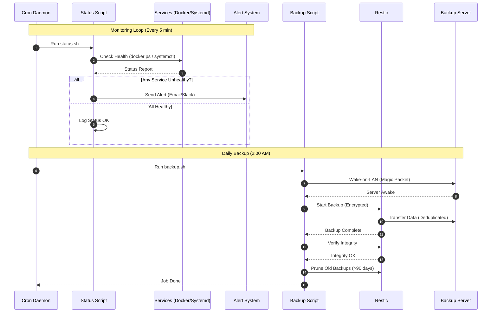

# Sequence Diagram: Phase 9 Monitoring & Backup

```mermaid
sequenceDiagram
    autonumber
    participant C as Cron Daemon
    participant M as Status Script
    participant S as Services (Docker/Systemd)
    participant A as Alert System
    participant B as Backup Script
    participant R as Restic
    participant SRV as Backup Server

    Note over C,A: Monitoring Loop (Every 5 min)
    C->>M: Run status.sh
    M->>S: Check Health (docker ps / systemctl)
    S-->>M: Status Report
    alt Any Service Unhealthy?
        M->>A: Send Alert (Email/Slack)
    else All Healthy
        M->>M: Log Status OK
    end

    Note over C,SRV: Daily Backup (2:00 AM)
    C->>B: Run backup.sh
    B->>SRV: Wake-on-LAN (Magic Packet)
    SRV-->>B: Server Awake
    B->>R: Start Backup (Encrypted)
    R->>SRV: Transfer Data (Deduplicated)
    R-->>B: Backup Complete
    B->>R: Verify Integrity
    R-->>B: Integrity OK
    B->>R: Prune Old Backups (>90 days)
    B-->>C: Job Done
```
