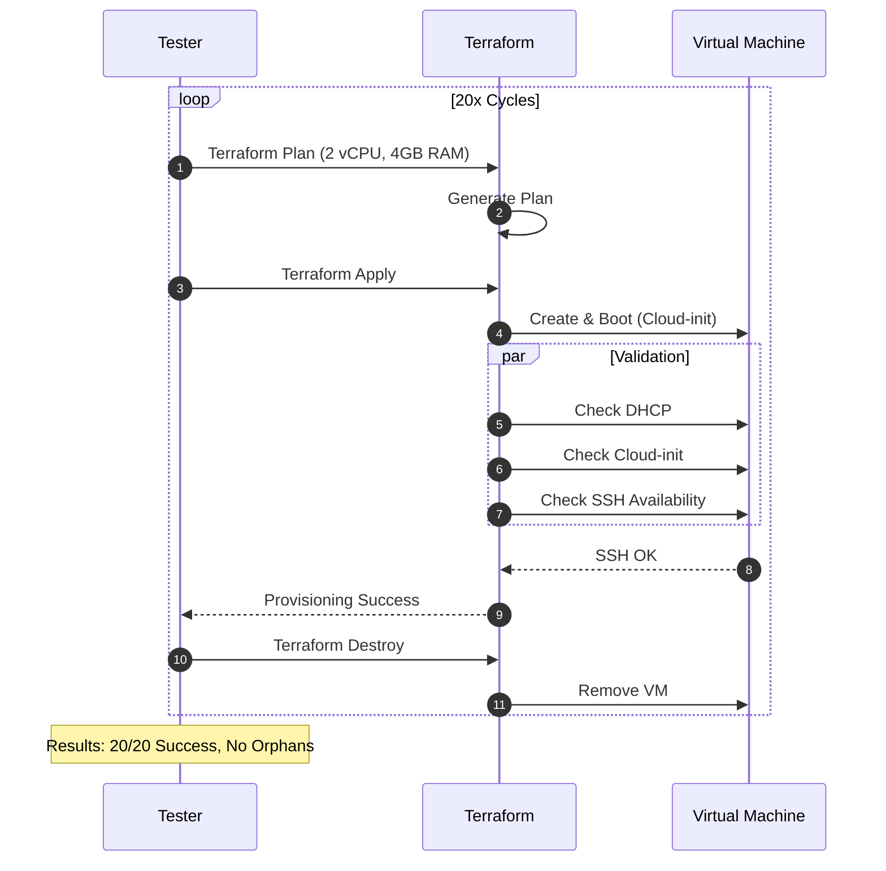

# Sequence Diagram: VM Provisioning Benchmark

```mermaid
sequenceDiagram
    autonumber
    participant U as Tester
    participant TF as Terraform
    participant VM as Virtual Machine

    loop 20x Cycles
        U->>TF: Terraform Plan (2 vCPU, 4GB RAM)
        TF->>TF: Generate Plan
        U->>TF: Terraform Apply
        TF->>VM: Create & Boot (Cloud-init)
        
        par Validation
            TF->>VM: Check DHCP
            TF->>VM: Check Cloud-init
            TF->>VM: Check SSH Availability
        end

        VM-->>TF: SSH OK
        TF-->>U: Provisioning Success
        
        U->>TF: Terraform Destroy
        TF->>VM: Remove VM
    end

    Note over U: Results: 20/20 Success, No Orphans
```
