# Complete PaaS System Flow - End to End Process

This diagram shows the complete journey from user registration to working services with all possible deployment paths and branches.

```mermaid
flowchart TB
    %% Starting Point
    Start([User Arrives at System]) --> HasAccount{Has Account?}

    %% Registration Branch
    HasAccount -->|No| Register[User Registration<br/>Flask /register]
    Register --> CreateUser[Create User in SQLite<br/>Username, Email, Password Hash]
    CreateUser --> Login

    %% Login Branch
    HasAccount -->|Yes| Login[User Login<br/>Flask /login]
    Login --> Auth{Authentication<br/>Success?}
    Auth -->|Failed| LoginRetry[Show Error Message]
    LoginRetry --> Login
    Auth -->|Success| Dashboard[User Dashboard<br/>View Configurations]

    %% Configuration Creation
    Dashboard --> Action{User Action}
    Action -->|Create New| ConfigForm[Service Selection Form<br/>Choose Services & Settings]
    Action -->|View Existing| ViewConfig[View Configuration Details]
    Action -->|Deploy Existing| ChooseDeployment

    %% Configuration Form Processing
    ConfigForm --> SelectServices[Select Services:<br/>Nextcloud, GitLab, Jellyfin,<br/>Vaultwarden, etc.]
    SelectServices --> ConfigDetails[Enter Configuration:<br/>- Config Name<br/>- Domain<br/>- Admin Email<br/>- Deployment Type]
    ConfigDetails --> PasswordChoice{Password<br/>Strategy?}

    %% Password Strategy Branch
    PasswordChoice -->|Universal| UniversalPwd[Single Password for All Services<br/>User Provides Password]
    PasswordChoice -->|Generated| GeneratedPwd[Unique Passwords per Service<br/>Stored in Vaultwarden]

    UniversalPwd --> SaveConfig
    GeneratedPwd --> SaveConfig

    %% Save Configuration
    SaveConfig[ProfileManager.create_profile:<br/>1. Create Git Branch<br/>2. Generate config.env<br/>3. Generate services.env<br/>4. Save to Database]
    SaveConfig --> GitBranch[Git Branch Created:<br/>username-configname]
    GitBranch --> ConfigSaved[Configuration Saved<br/>Redirect to Dashboard]
    ConfigSaved --> Dashboard

    %% Deployment Choice
    ViewConfig --> ChooseDeployment
    ChooseDeployment{Choose Deployment<br/>Method}

    %% VM Provisioning Branch (Optional)
    ChooseDeployment -->|Need New VM| VMProvision[VM Provisioning Path]
    VMProvision --> ProxmoxAPI[Proxmox API Client<br/>Initialize Connection]
    ProxmoxAPI --> TerraformInit[Terraform Init<br/>Load bpg/proxmox Provider]
    TerraformInit --> TerraformPlan[Terraform Plan<br/>Read vm_specs.yaml]
    TerraformPlan --> TerraformApply[Terraform Apply<br/>Create VM from Template]
    TerraformApply --> VMBoot[VM Boot Process]

    VMBoot --> CloudInit[Cloud-init Execution:<br/>- Network Config<br/>- SSH Keys<br/>- User Creation<br/>- Package Install]
    CloudInit --> QEMUAgent[QEMU Guest Agent Start]
    QEMUAgent --> SSHReady{SSH Available?}

    SSHReady -->|Timeout| VMFailed[VM Provisioning Failed<br/>Show Error to User]
    SSHReady -->|Success| AnsibleCheck{Run Ansible?}
    VMFailed --> Dashboard

    AnsibleCheck -->|Yes| AnsibleRun[Ansible Playbook:<br/>- Install Docker<br/>- Configure Firewall<br/>- Setup Dependencies]
    AnsibleCheck -->|No| VMReady
    AnsibleRun --> VMReady[VM Ready for Deployment]
    VMReady --> ServiceDeployment

    %% Direct Deployment Branch
    ChooseDeployment -->|Use Existing Host| ServiceDeployment

    %% Service Deployment Type Selection
    ServiceDeployment{Deployment Type}

    %% Docker Compose Path
    ServiceDeployment -->|Docker Compose| DockerDeploy[Docker Deployment Path]
    DockerDeploy --> LoadEnv[Load Environment:<br/>- config.env<br/>- services.env<br/>- profiles.env]
    LoadEnv --> DockerCompose[docker-compose up -d<br/>--profile selected_profiles]

    DockerCompose --> PullImages[Pull Docker Images:<br/>- traefik:latest<br/>- nextcloud:latest<br/>- lldap:latest<br/>- authelia:latest<br/>- vaultwarden:latest]

    PullImages --> CreateNetworks[Create Docker Networks:<br/>- traefik_public<br/>- backend]
    CreateNetworks --> CreateVolumes[Create Docker Volumes:<br/>Persistent Storage]
    CreateVolumes --> StartCore[Start Core Services:<br/>1. Traefik<br/>2. LLDAP<br/>3. Redis<br/>4. Authelia]

    StartCore --> TraefikReady{Traefik<br/>Healthy?}
    TraefikReady -->|Failed| DeployFailed
    TraefikReady -->|Success| LLDAPReady{LLDAP<br/>Healthy?}

    LLDAPReady -->|Failed| DeployFailed
    LLDAPReady -->|Success| StartApps[Start Application Services:<br/>Based on Selected Profile]

    StartApps --> NextcloudStart{Nextcloud<br/>Selected?}
    NextcloudStart -->|Yes| NextcloudUp[Start Nextcloud + PostgreSQL]
    NextcloudStart -->|No| GitLabStart
    NextcloudUp --> GitLabStart

    GitLabStart{GitLab<br/>Selected?}
    GitLabStart -->|Yes| GitLabUp[Start GitLab + PostgreSQL]
    GitLabStart -->|No| JellyfinStart
    GitLabUp --> JellyfinStart

    JellyfinStart{Jellyfin<br/>Selected?}
    JellyfinStart -->|Yes| JellyfinUp[Start Jellyfin]
    JellyfinStart -->|No| HealthCheck
    JellyfinUp --> HealthCheck

    HealthCheck[Docker Health Checks:<br/>Wait for all containers healthy]
    HealthCheck --> AllHealthy{All Services<br/>Healthy?}
    AllHealthy -->|Failed| DeployFailed
    AllHealthy -->|Success| DockerSuccess[Docker Deployment Complete]
    DockerSuccess --> PostDeploy

    %% NixOS Path
    ServiceDeployment -->|NixOS| NixOSDeploy[NixOS Deployment Path]
    NixOSDeploy --> FlakeCheck[nix flake check<br/>Validate Configuration]
    FlakeCheck --> FlakeValid{Flake Valid?}
    FlakeValid -->|Failed| DeployFailed
    FlakeValid -->|Success| NixBuild[nixos-rebuild build<br/>Build System Configuration]

    NixBuild --> BuildSuccess{Build<br/>Success?}
    BuildSuccess -->|Failed| DeployFailed
    BuildSuccess -->|Success| NixSwitch[nixos-rebuild switch<br/>Activate Configuration]

    NixSwitch --> SystemdStart[Systemd Service Start:<br/>Based on services.paas.*.enable]
    SystemdStart --> NixServices[Start NixOS Services:<br/>- traefik.service<br/>- lldap.service<br/>- authelia.service<br/>- homer.service<br/>- jellyfin.service]

    NixServices --> SystemdHealth{All Services<br/>Active?}
    SystemdHealth -->|Failed| RollbackOption{Rollback?}
    RollbackOption -->|Yes| NixRollback[nixos-rebuild switch --rollback]
    RollbackOption -->|No| DeployFailed
    NixRollback --> Dashboard

    SystemdHealth -->|Success| NixSuccess[NixOS Deployment Complete]
    NixSuccess --> PostDeploy

    %% Post Deployment Configuration
    PostDeploy[Post-Deployment Configuration]
    PostDeploy --> TraefikDiscovery[Traefik Service Discovery:<br/>Read Docker Labels or<br/>NixOS Configuration]

    TraefikDiscovery --> CreateRouters[Create Dynamic Routers:<br/>For Each Service]
    CreateRouters --> SSLChallenge{SSL<br/>Needed?}

    SSLChallenge -->|Yes| LetsEncrypt[Let's Encrypt Challenge:<br/>HTTP-01 Validation]
    LetsEncrypt --> CertIssued{Certificate<br/>Issued?}
    CertIssued -->|Failed| SSLWarning[SSL Warning<br/>Continue without HTTPS]
    CertIssued -->|Success| SSLReady[SSL Certificates Ready]
    SSLWarning --> RoutingReady
    SSLReady --> RoutingReady
    SSLChallenge -->|No| RoutingReady

    RoutingReady[Traefik Routing Ready]
    RoutingReady --> UserProvision{Provision<br/>Users?}

    %% User Provisioning
    UserProvision -->|Yes| CreateLDAPUser[Create LLDAP User:<br/>via GraphQL API]
    UserProvision -->|No| ServicesReady

    CreateLDAPUser --> PasswordType{Password<br/>Type?}
    PasswordType -->|Universal| SetUniversalPwd[Set Same Password<br/>Across All Services]
    PasswordType -->|Generated| GenUniquePwds[Generate Unique Passwords<br/>Store in Vaultwarden]

    SetUniversalPwd --> ProvisionNextcloud
    GenUniquePwds --> StoreVault[Store Passwords in Vaultwarden]
    StoreVault --> ProvisionNextcloud

    ProvisionNextcloud{Nextcloud<br/>Enabled?}
    ProvisionNextcloud -->|Yes| NextcloudOCC[occ user:add<br/>Create Nextcloud User]
    ProvisionNextcloud -->|No| ProvisionGitLab
    NextcloudOCC --> ConfigureNextcloudLDAP[Configure Nextcloud LDAP:<br/>Enable LDAP Auth]
    ConfigureNextcloudLDAP --> ProvisionGitLab

    ProvisionGitLab{GitLab<br/>Enabled?}
    ProvisionGitLab -->|Yes| GitLabAPI[GitLab API:<br/>Create User via REST]
    ProvisionGitLab -->|No| ProvisionJellyfin
    GitLabAPI --> ProvisionJellyfin

    ProvisionJellyfin{Jellyfin<br/>Enabled?}
    ProvisionJellyfin -->|Yes| JellyfinAPI[Jellyfin API:<br/>Create User]
    ProvisionJellyfin -->|No| UserProvDone
    JellyfinAPI --> UserProvDone

    UserProvDone[User Provisioning Complete]
    UserProvDone --> ServicesReady

    %% Services Ready
    ServicesReady[All Services Ready]
    ServicesReady --> NotifyUser[Notify User:<br/>Deployment Complete<br/>Show Service URLs]
    NotifyUser --> ServiceURLs[Display Service URLs:<br/>- https://nextcloud.DOMAIN<br/>- https://gitlab.DOMAIN<br/>- https://jellyfin.DOMAIN<br/>- https://auth.DOMAIN]
    ServiceURLs --> Dashboard

    %% User Access Flow (SSO)
    Dashboard --> UserAccess{User Wants to<br/>Access Service?}
    UserAccess -->|Yes| BrowseService[User Navigates to Service URL]
    UserAccess -->|No| End

    BrowseService --> TraefikIntercept[Traefik Intercepts Request]
    TraefikIntercept --> CheckMiddleware{Authelia<br/>Middleware?}

    CheckMiddleware -->|No| DirectAccess[Direct Service Access]
    CheckMiddleware -->|Yes| ForwardAuth[Forward Auth to Authelia]

    ForwardAuth --> SessionCheck{Valid<br/>Session?}
    SessionCheck -->|Yes| HeadersSet[Set Auth Headers:<br/>Remote-User, Remote-Email]
    SessionCheck -->|No| AutheliaLogin[Redirect to Authelia Login]

    AutheliaLogin --> EnterCreds[User Enters Credentials]
    EnterCreds --> LDAPAuth[LDAP Authentication<br/>via LLDAP]
    LDAPAuth --> AuthSuccess{Auth<br/>Success?}

    AuthSuccess -->|Failed| AuthRetry[Show Login Error]
    AuthRetry --> AutheliaLogin
    AuthSuccess -->|Success| TwoFACheck{2FA<br/>Enabled?}

    TwoFACheck -->|Yes| TOTPPrompt[Prompt for TOTP Code]
    TwoFACheck -->|No| CreateSession
    TOTPPrompt --> ValidateTOTP{TOTP<br/>Valid?}
    ValidateTOTP -->|Failed| AuthRetry
    ValidateTOTP -->|Success| CreateSession

    CreateSession[Create Authelia Session<br/>Set Session Cookie]
    CreateSession --> RedirectBack[Redirect to Original URL]
    RedirectBack --> HeadersSet

    HeadersSet --> ForwardToService[Forward Request to Service<br/>with Auth Context]
    DirectAccess --> ServiceRespond
    ForwardToService --> ServiceRespond[Service Responds<br/>User Authenticated]

    ServiceRespond --> SSOBenefit[SSO Benefit:<br/>Other Services Auto-Authenticated<br/>Same Session Cookie]
    SSOBenefit --> UserWorking[User Working with Services]

    UserWorking --> MoreServices{Access Another<br/>Service?}
    MoreServices -->|Yes| BrowseService
    MoreServices -->|No| End([End: System Fully Operational])

    %% Failure Path
    DeployFailed[Deployment Failed]
    DeployFailed --> ShowLogs[Show Deployment Logs<br/>to User]
    ShowLogs --> RetryOption{Retry<br/>Deployment?}
    RetryOption -->|Yes| ServiceDeployment
    RetryOption -->|No| Dashboard

    %% Styling
    style Start fill:#e3f2fd,stroke:#1976d2,stroke-width:3px
    style End fill:#c8e6c9,stroke:#388e3c,stroke-width:3px
    style Dashboard fill:#fff3e0,stroke:#f57c00,stroke-width:2px
    style DockerSuccess fill:#c8e6c9,stroke:#388e3c,stroke-width:2px
    style NixSuccess fill:#c8e6c9,stroke:#388e3c,stroke-width:2px
    style ServicesReady fill:#c8e6c9,stroke:#388e3c,stroke-width:2px
    style DeployFailed fill:#ffcdd2,stroke:#d32f2f,stroke-width:2px
    style UserWorking fill:#c8e6c9,stroke:#388e3c,stroke-width:2px

    style VMProvision fill:#e1bee7,stroke:#7b1fa2
    style DockerDeploy fill:#bbdefb,stroke:#1976d2
    style NixOSDeploy fill:#c5e1a5,stroke:#558b2f
    style PostDeploy fill:#ffecb3,stroke:#ffa000
    style UserProvision fill:#ffccbc,stroke:#e64a19
```

## Flow Description

### Phase 1: User Onboarding (Start → Dashboard)
The process begins when a user arrives at the system. They either register a new account (creating credentials in SQLite via Flask) or log in with existing credentials. Upon successful authentication, they are directed to the dashboard where they can view existing configurations or create new ones.

### Phase 2: Configuration Creation (Dashboard → ConfigSaved)
When creating a new configuration, users select which services they want (Nextcloud, GitLab, Jellyfin, etc.), specify deployment settings (domain, email), and choose a password strategy. The ProfileManager creates a Git branch for version control, generates configuration files (config.env, services.env), and saves everything to the database.

### Phase 3: Infrastructure Provisioning (Optional: VM Path)
If a new VM is needed, the system uses the Proxmox API through Terraform to provision infrastructure. The process includes creating VMs from cloud templates, running cloud-init for initial configuration, starting the QEMU guest agent, and optionally running Ansible playbooks to install Docker and configure the system.

### Phase 4: Service Deployment (Docker or NixOS)
**Docker Path**: Loads environment variables, pulls images, creates networks and volumes, starts core services (Traefik, LLDAP, Redis, Authelia) in dependency order, then starts application services based on selected profiles. Health checks ensure all containers are running properly.

**NixOS Path**: Validates the flake configuration, builds the system configuration declaratively, activates it with nixos-rebuild switch, and starts systemd services. Offers rollback capability if deployment fails.

### Phase 5: Post-Deployment Configuration
Traefik performs service discovery (reading Docker labels or NixOS configuration), creates dynamic routing rules, requests SSL certificates from Let's Encrypt via HTTP-01 challenge, and sets up HTTPS endpoints for all services.

### Phase 6: User Provisioning
Creates users in LLDAP (central directory), provisions users in individual services (Nextcloud via occ, GitLab via API, Jellyfin via API), and either sets a universal password across all services or generates unique passwords stored in Vaultwarden.

### Phase 7: User Access with SSO
When users navigate to a service URL, Traefik intercepts the request and forwards it to Authelia for authentication. If no valid session exists, users log in once with their LDAP credentials (optionally with 2FA). Authelia creates a session cookie that works across all services. Subsequent requests to other services are automatically authenticated without additional logins.

### Phase 8: Operational State
The system is fully operational with all services running, SSL certificates active, routing configured, users provisioned, and SSO enabling seamless access across all applications. Users can work with multiple services using a single authentication session.

## Decision Points and Branches

- **Password Strategy**: Universal (same password everywhere) vs Generated (unique per service)
- **VM Provisioning**: Create new VM vs use existing infrastructure
- **Deployment Method**: Docker Compose (container-based) vs NixOS (declarative system)
- **Ansible**: Run configuration management vs skip if already configured
- **SSL**: Enable HTTPS with Let's Encrypt vs HTTP only
- **User Provisioning**: Automatic user creation vs manual setup
- **2FA**: Enable two-factor authentication vs password only
- **Service Selection**: Individual service profiles (core, authentication, collaboration, media)

## Error Handling and Recovery

- **VM Provisioning Failure**: Return to dashboard with error logs, allow retry
- **Docker Health Check Failure**: Show deployment logs, offer retry
- **NixOS Build Failure**: Offer rollback to previous working configuration
- **SSL Certificate Failure**: Continue with HTTP, show warning
- **Authentication Failure**: Allow retry with error message
- **Service-Specific Failures**: Log errors, continue with other services

## Key Success Metrics

- All containers/services report healthy status
- Traefik routing configured and responding
- SSL certificates issued and valid
- LDAP authentication working
- Users can access services with SSO
- No orphaned resources or failed deployments
