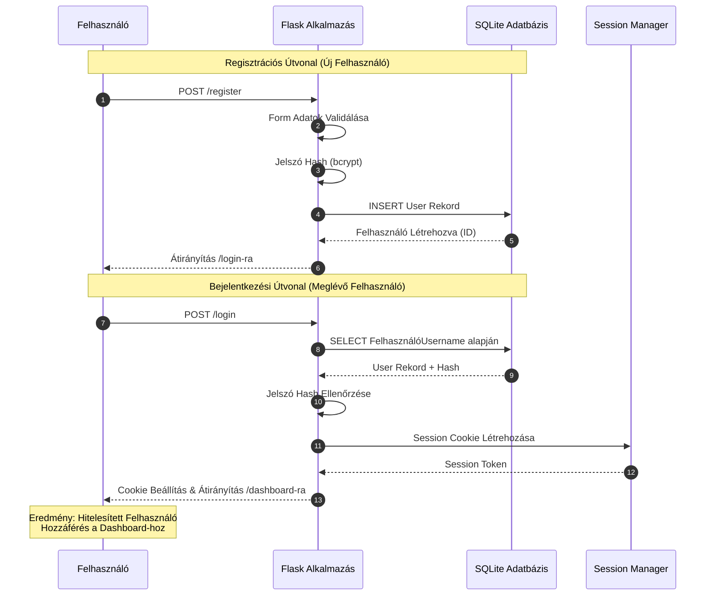

# Fázis 1: Felhasználói Regisztráció és Bejelentkezés

Felhasználói regisztráció, bejelentkezés és kezdeti dashboard elérés folyamata.

## Folyamat Leírása

A felhasználói onboarding folyamat két fő útvonalon halad. Az új felhasználók regisztrációkor megadják felhasználónevüket, email címüket és jelszavukat, amelyet a Flask alkalmazás bcrypt algoritmussal hashel mielőtt az SQLite adatbázisba mentené. A sikeres regisztráció után a felhasználó automatikusan átirányításra kerül a bejelentkezési oldalra.

A meglévő felhasználók bejelentkezéskor a rendszer lekéri a felhasználói rekordot az adatbázisból, ellenőrzi a megadott jelszó hash-ét a tárolt hash-sel szemben, és sikeres autentikáció esetén létrehoz egy session cookie-t. Ez a cookie biztonságosan tárolja a felhasználói munkamenet azonosítóját, amely lehetővé teszi az állapotmegőrzést a HTTP kérések között.

## Technikai Részletek

- **Autentikáció**: Flask-Login extension használata
- **Jelszó Biztonság**: Bcrypt hash (work factor: 12)
- **Session Tárolás**: Server-side sessions Flask-SQLAlchemy-vel
- **CSRF Védelem**: WTForms automatic token generation
- **Kimenet**: Sikeres bejelentkezés után hozzáférés a felhasználói dashboard-hoz
