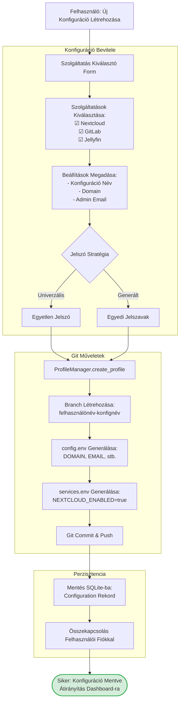

# Fázis 2: Konfiguráció Létrehozása és Git Menedzsment

Szolgáltatás kiválasztás és konfigurációs fájlok generálása Git verziókezeléssel.



## Folyamat Leírása

A konfiguráció létrehozási folyamat a felhasználó igényei alapján épül fel. A szolgáltatás kiválasztó form lehetővé teszi, hogy a felhasználó checkbox-okkal jelölje be a kívánt szolgáltatásokat, mint például Nextcloud, GitLab, Jellyfin, Vaultwarden és további 20+ PaaS szolgáltatást. A form második része tartalmazza a globális beállításokat, beleértve a konfiguráció nevét, a domain nevet és az adminisztrátor email címét.

A jelszó stratégia választás kritikus döntési pont. Az univerzális jelszó opció esetén a felhasználó egy központi jelszót ad meg, amely minden szolgáltatásban ugyanaz lesz, megkönnyítve a bejelentkezést, de csökkentve a biztonsági szintet. A generált jelszavak opció esetén a rendszer egyedi, erős jelszavakat generál minden szolgáltatáshoz, amelyeket biztonságosan tárol a Vaultwarden password manager-ben.

A ProfileManager osztály végzi a tényleges konfigurációs fájlok generálását. Először létrehoz egy új Git branch-et a felhasználó-konfiguráció név kombinációból, amely verziókezelt módon tárolja a konfigurációt. Ezután generálja a config.env fájlt a globális változókkal és a services.env fájlt a szolgáltatás-specifikus beállításokkal. Végül commit-olja és push-olja a változtatásokat a Git repository-ba, majd elmenti a konfiguráció metaadatait az SQLite adatbázisba.

## Generált Fájlok

**config.env példa**:
```
DOMAIN=example.com
ADMIN_EMAIL=admin@example.com
TIMEZONE=Europe/Budapest
UNIVERSAL_USERNAME=admin
```

**services.env példa**:
```
NEXTCLOUD_ENABLED=true
GITLAB_ENABLED=true
JELLYFIN_ENABLED=true
VAULTWARDEN_ENABLED=false
```

## Kimenet

A sikeres konfiguráció létrehozás után a felhasználó visszakerül a dashboard-ra, ahol láthatja az újonnan létrehozott konfigurációt a listában, és lehetősége van azonnal deployment-et indítani.
