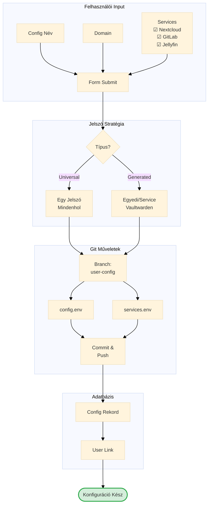

# Fázis 2: Konfiguráció Létrehozása

```mermaid
%%{init: {'theme':'base', 'themeVariables': { 'fontSize':'13px'}}}%%
flowchart TB
    subgraph INPUT[Felhasználói Input]
        A[Config Név] --> D
        B[Domain] --> D
        C[Services<br/>☑ Nextcloud<br/>☑ GitLab<br/>☑ Jellyfin] --> D
        D[Form Submit]
    end

    subgraph PASS[Jelszó Stratégia]
        E{Típus?}
        E -->|Universal| F[Egy Jelszó<br/>Mindenhol]
        E -->|Generated| G[Egyedi/Service<br/>Vaultwarden]
    end

    subgraph GIT[Git Műveletek]
        H[Branch:<br/>user-config]
        I[config.env]
        J[services.env]
        H --> I & J
        I & J --> K[Commit &<br/>Push]
    end

    subgraph DB[Adatbázis]
        L[Config Rekord]
        M[User Link]
        L --> M
    end

    D --> E
    F & G --> H
    K --> L
    M --> N([Konfiguráció Kész])

    style N fill:#d4edda,stroke:#28a745,stroke-width:2px
```
