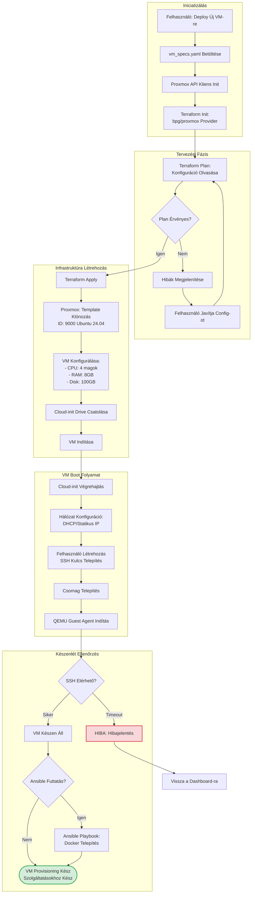

# Fázis 3: Infrastruktúra Provisioning (Opcionális VM)

Automatizált VM létrehozás Terraform és Proxmox API használatával.



## Folyamat Leírása

A VM provisioning folyamat akkor kerül aktiválásra, amikor a felhasználó új virtuális gépre szeretne szolgáltatásokat telepíteni. A rendszer először betölti a vm_specs.yaml fájlt, amely tartalmazza a VM hardver specifikációit, hálózati beállításokat és az operációs rendszer konfigurációt. A Proxmox API kliens inicializálása után a Terraform provider betöltésre kerül, amely a bpg/proxmox provider-t használja a Proxmox VE API-val való kommunikációra.

A tervezési fázisban a Terraform plan parancs kiértékeli a konfigurációt és előnézetet nyújt a létrehozandó erőforrásokról. Ha a plan érvényes, a Terraform apply parancs végrehajtja a tényleges infrastruktúra létrehozást. Ez magában foglalja egy előre elkészített Ubuntu 24.04 cloud template klónozását, a VM hardver beállításait (CPU, RAM, disk méret), és a cloud-init drive csatolását.

A VM boot folyamat során a cloud-init automatikusan végrehajtja a kezdeti konfigurációt. Ez tartalmazza a hálózati beállítások alkalmazását (DHCP vagy statikus IP), a felhasználói fiókok létrehozását, az SSH kulcsok telepítését, a szükséges csomagok telepítését és a QEMU Guest Agent indítását. A QEMU Agent biztosítja a Proxmox és a VM közötti kommunikációt, lehetővé téve az IP cím lekérdezését és más VM információk megszerzését.

A validációs fázisban a rendszer SSH elérhetőségi tesztet végez. Ha a VM 60 másodpercen belül nem válaszol SSH-n, timeout hiba keletkezik és a folyamat megszakad. Sikeres SSH kapcsolat esetén opcionálisan futtatható egy Ansible playbook, amely további konfigurációkat végez, mint például Docker telepítés, firewall beállítások és dependency-k telepítése.

## Terraform Konfiguráció

A vm_specs.yaml példa:
```yaml
vm_name: "paas-server-01"
cpu_cores: 4
memory_mb: 8192
disk_size_gb: 100
network:
  bridge: "vmbr0"
  ip_config: "dhcp"
cloud_init:
  user: "ubuntu"
  ssh_keys:
    - "ssh-rsa AAAA..."
```

## Ansible Post-Configuration

Opcionálisan futtatható playbook szerepek:
- Docker Engine telepítés
- Docker Compose telepítés
- UFW firewall konfiguráció
- Fail2ban telepítés SSH védelem
- NTP időszinkronizálás

## Kimenet

Sikeres provisioning után egy teljes mértékben konfigurált, SSH-n elérhető Ubuntu 24.04 VM áll rendelkezésre, amely készen áll Docker konténerek vagy NixOS konfiguráció fogadására.
