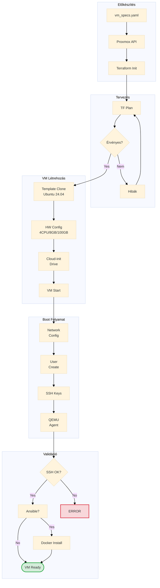

# Fázis 3: VM Provisioning

```mermaid
%%{init: {'theme':'base', 'themeVariables': { 'fontSize':'13px'}}}%%
flowchart TB
    subgraph PREP[Előkészítés]
        direction LR
        A[vm_specs.yaml] --> B[Proxmox API]
        B --> C[Terraform Init]
    end

    subgraph PLAN[Tervezés]
        direction LR
        D[TF Plan] --> E{Érvényes?}
        E -->|Nem| F[Hibák]
        F --> D
    end

    subgraph CREATE[VM Létrehozás]
        direction TB
        G[Template Clone<br/>Ubuntu 24.04] --> H[HW Config<br/>4CPU/8GB/100GB]
        H --> I[Cloud-init<br/>Drive]
        I --> J[VM Start]
    end

    subgraph BOOT[Boot Folyamat]
        direction LR
        K[Network<br/>Config] --> L[User<br/>Create]
        L --> M[SSH Keys]
        M --> N[QEMU<br/>Agent]
    end

    subgraph CHECK[Validáció]
        direction TB
        O{SSH OK?}
        O -->|Yes| P[Ansible?]
        O -->|No| Q[ERROR]
        P -->|Yes| R[Docker Install]
        P -->|No| S
        R --> S([VM Ready])
    end

    C --> D
    E -->|Yes| G
    J --> K
    N --> O

    style S fill:#d4edda,stroke:#28a745,stroke-width:2px
    style Q fill:#f8d7da,stroke:#dc3545,stroke-width:2px
```
