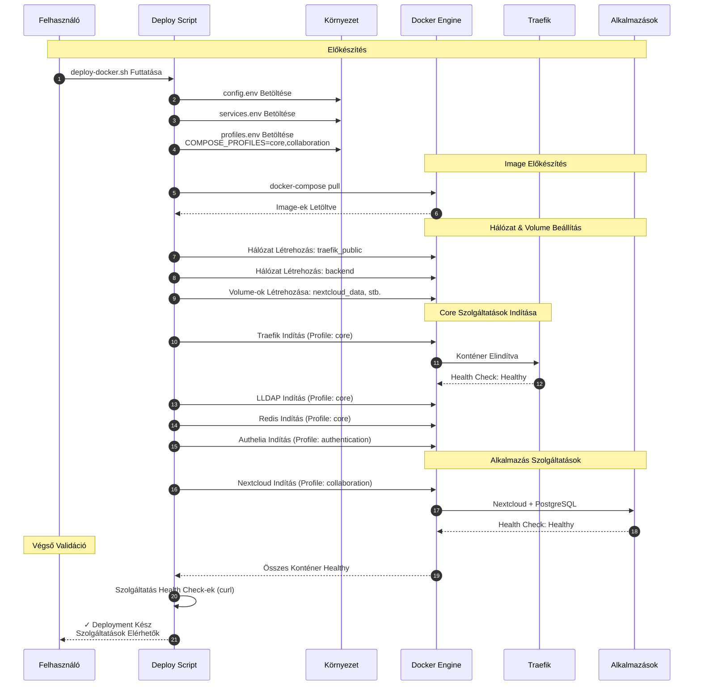

# Fázis 4A: Docker Compose Szolgáltatás Deployment

Konténer orchestration profil-alapú szolgáltatás aktiválással.



## Folyamat Leírása

A Docker Compose alapú deployment a profil-alapú szolgáltatás aktiválás koncepciójára épül. A deploy script először betölti a három környezeti változó fájlt: a config.env globális beállításokat tartalmaz (domain, timezone, admin email), a services.env jelzi mely szolgáltatások engedélyezettek, míg a profiles.env határozza meg a Docker Compose profilokat.

A rendszer négy fő profilt definiál: core (Traefik, LLDAP, Redis), authentication (Authelia), collaboration (Nextcloud, GitLab, Seafile), és media (Jellyfin, Immich). A felhasználó által kiválasztott szolgáltatások alapján a megfelelő profilok automatikusan aktiválódnak.

Az image előkészítési fázis során a docker-compose pull parancs letölti az összes szükséges Docker image-et a Docker Hub-ról vagy más registry-kről. Ez biztosítja, hogy a legfrissebb verziók legyenek használatban és csökkenti a deployment időt, mivel a pull művelet párhuzamosan történik.

A hálózati infrastruktúra kialakítása két különálló Docker hálózat létrehozásával történik. A traefik_public hálózat külső forgalom számára elérhető és minden szolgáltatás csatlakozik hozzá, amely Traefik-en keresztül elérhető. A backend hálózat belső kommunikációra szolgál szolgáltatások között, mint például az adatbázis kapcsolatok.

A core szolgáltatások indítása szigorú sorrendet követ. Először a Traefik reverse proxy indul, amely a belépési pont minden HTTP/HTTPS kéréshez. Ezután az LLDAP címtárszolgáltatás, amely központi felhasználó adatbázisként szolgál. A Redis cache a session tároláshoz szükséges, végül az Authelia authentikációs middleware indul.

Az alkalmazás szolgáltatások a kiválasztott profilok alapján indulnak. Minden szolgáltatás saját PostgreSQL adatbázis instance-t kap izolált adattárolás céljából. A Docker health check mechanizmus folyamatosan monitorozza a konténerek állapotát, és csak akkor jelzi a deployment sikerességét, ha minden konténer healthy státuszba került.

## Docker Compose Profil Példa

```yaml
services:
  nextcloud:
    profiles: ["collaboration"]
    depends_on:
      - traefik
      - lldap
      - db-nextcloud
    healthcheck:
      test: ["CMD", "curl", "-f", "http://localhost"]
      interval: 30s
      timeout: 10s
      retries: 3
```

## Deployment Parancs

```bash
COMPOSE_PROFILES=core,authentication,collaboration \
  docker-compose up -d
```

## Health Check Validáció

A deployment script végén curl parancsokkal ellenőrzi minden szolgáltatás elérhetőségét:
- Traefik dashboard: http://localhost:8080
- LLDAP web UI: http://localhost:17170
- Authelia: http://localhost:9091
- Nextcloud: https://nextcloud.example.com

## Kimenet

Sikeres deployment esetén minden kiválasztott szolgáltatás fut, elérhető a megfelelő domain-en keresztül, és a Traefik automatikusan kezeli a routing-ot és SSL tanúsítványokat.
