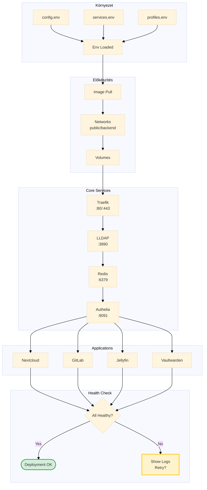

# Fázis 4A: Docker Compose Deployment

```mermaid
%%{init: {'theme':'base', 'themeVariables': { 'fontSize':'13px'}}}%%
flowchart TB
    subgraph ENV[Környezet]
        direction LR
        A[config.env] --> D
        B[services.env] --> D
        C[profiles.env] --> D
        D[Env Loaded]
    end

    subgraph PREP[Előkészítés]
        direction LR
        E[Image Pull] --> F[Networks<br/>public/backend]
        F --> G[Volumes]
    end

    subgraph CORE[Core Services]
        direction TB
        H[Traefik<br/>:80/:443] --> I[LLDAP<br/>:3890]
        I --> J[Redis<br/>:6379]
        J --> K[Authelia<br/>:9091]
    end

    subgraph APPS[Applications]
        direction LR
        L[Nextcloud]
        M[GitLab]
        N[Jellyfin]
        O[Vaultwarden]
    end

    subgraph HEALTH[Health Check]
        direction TB
        P{All Healthy?}
        P -->|Yes| Q([Deployment OK])
        P -->|No| R[Show Logs<br/>Retry?]
    end

    D --> E
    G --> H
    K --> L & M & N & O
    L & M & N & O --> P

    style Q fill:#d4edda,stroke:#28a745,stroke-width:2px
    style R fill:#fff3cd,stroke:#ffc107,stroke-width:2px
```
