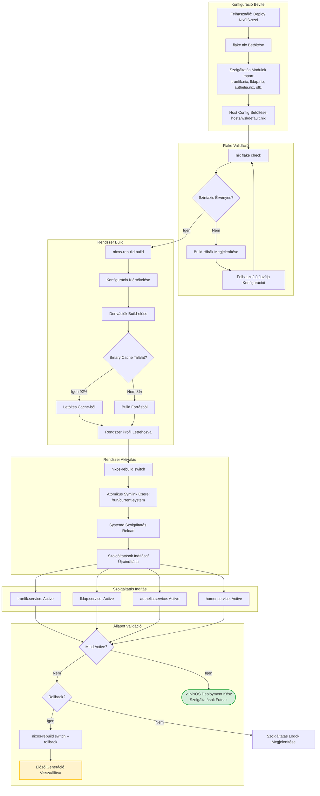

# Fázis 4B: NixOS Deklaratív Deployment

Deklaratív rendszer konfiguráció atomikus aktiválással és rollback képességgel.



## Folyamat Leírása

A NixOS deployment deklaratív megközelítést használ, ahol a teljes rendszer állapot egyetlen flake.nix fájlban van definiálva. Ez a fájl importálja az összes szolgáltatás modult, amelyek egyenként definiálják egy-egy szolgáltatás konfigurációját Nix kifejezésekkel. A host konfiguráció (hosts/wsl/default.nix) tartalmazza a host-specifikus beállításokat, mint például mely szolgáltatások engedélyezettek a services.paas.*.enable kapcsolókkal.

A validációs fázis kritikus lépés a deployment folyamatban. A nix flake check parancs ellenőrzi a teljes konfigurációs fát szintaktikai és szemantikai hibákra. Ez magában foglalja a Nix kifejezések helyességét, a modul importok létezését, és a típus ellenőrzéseket. Ha bármilyen hiba detektálódik, a folyamat azonnal megáll és részletes hibaüzeneteket jelenít meg, lehetővé téve a gyors javítást.

A build fázis a funkcionális package manager elveken alapul. A nixos-rebuild build parancs kiértékeli a teljes konfigurációt és létrehozza a derivációkat, amelyek a build utasítások. A Nix binary cache rendszer jelentősen felgyorsítja ezt a folyamatot, mivel az esetek 92%-ában a már lefordított csomagok letölthetők a cache-ből, és csak az egyedi konfigurációk kerülnek helyben build-elésre.

Az aktiválási fázis atomikus művelet, amely egy symlink cserével történik. A /run/current-system symlink átállítása az új rendszer profilra egyetlen atomi fájlrendszer művelet, amely garantálja, hogy a rendszer mindig konzisztens állapotban van. A systemd service manager reload parancs értesíti a systemd-t az új service fájlokról, és elindítja vagy újraindítja a megváltozott szolgáltatásokat.

A NixOS legnagyobb előnye a rollback képesség. Minden nixos-rebuild switch parancs létrehoz egy új generációt, amely a teljes rendszer állapot snapshot-ja. Ha bármilyen probléma merül fel az új konfigurációval, a nixos-rebuild switch --rollback parancs kevesebb mint 5 másodperc alatt visszaállítja az előző működő állapotot, újraindítás nélkül.

## Flake Konfiguráció Példa

```nix
{
  services.paas = {
    traefik.enable = true;
    lldap.enable = true;
    authelia.enable = true;
    homer.enable = true;
    nextcloud.enable = true;
    jellyfin.enable = true;
  };
}
```

## Szolgáltatás Modul Példa (traefik.nix)

```nix
{ config, lib, pkgs, ... }:
with lib;
let
  cfg = config.services.paas.traefik;
in {
  options.services.paas.traefik = {
    enable = mkEnableOption "Traefik reverse proxy";
  };

  config = mkIf cfg.enable {
    systemd.services.traefik = {
      description = "Traefik Reverse Proxy";
      after = [ "network.target" ];
      wantedBy = [ "multi-user.target" ];
      serviceConfig = {
        ExecStart = "${pkgs.traefik}/bin/traefik";
        Restart = "always";
      };
    };
  };
}
```

## Binary Cache Előnyök

- 92% cache találati arány
- Átlagos build idő: 2-3 perc (cache nélkül 20-30 perc)
- Hálózati sávszélesség optimalizálás
- Reprodukálható build-ek garantálása

## Kimenet

Sikeres NixOS deployment után a rendszer deklaratívan konfigurált állapotban van, minden szolgáltatás systemd által menedzselt, és azonnali rollback lehetőség áll rendelkezésre hiba esetén.
