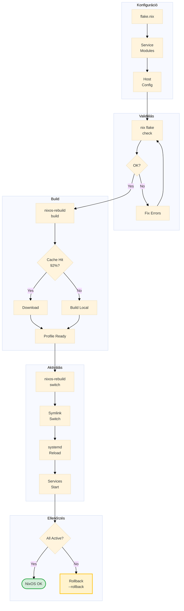

# Fázis 4B: NixOS Deployment

```mermaid
%%{init: {'theme':'base', 'themeVariables': { 'fontSize':'13px'}}}%%
flowchart TB
    subgraph CONFIG[Konfiguráció]
        direction LR
        A[flake.nix] --> B[Service<br/>Modules]
        B --> C[Host<br/>Config]
    end

    subgraph VALIDATE[Validálás]
        direction TB
        D[nix flake<br/>check] --> E{OK?}
        E -->|No| F[Fix Errors]
        F --> D
    end

    subgraph BUILD[Build]
        direction LR
        G[nixos-rebuild<br/>build] --> H{Cache Hit<br/>92%?}
        H -->|Yes| I[Download]
        H -->|No| J[Build Local]
        I --> K[Profile Ready]
        J --> K
    end

    subgraph ACTIVATE[Aktiválás]
        direction TB
        L[nixos-rebuild<br/>switch] --> M[Symlink<br/>Switch]
        M --> N[systemd<br/>Reload]
        N --> O[Services<br/>Start]
    end

    subgraph CHECK[Ellenőrzés]
        direction LR
        P{All Active?}
        P -->|Yes| Q([NixOS OK])
        P -->|No| R[Rollback<br/>--rollback]
    end

    C --> D
    E -->|Yes| G
    K --> L
    O --> P

    style Q fill:#d4edda,stroke:#28a745,stroke-width:2px
    style R fill:#fff3cd,stroke:#ffc107,stroke-width:2px
```
