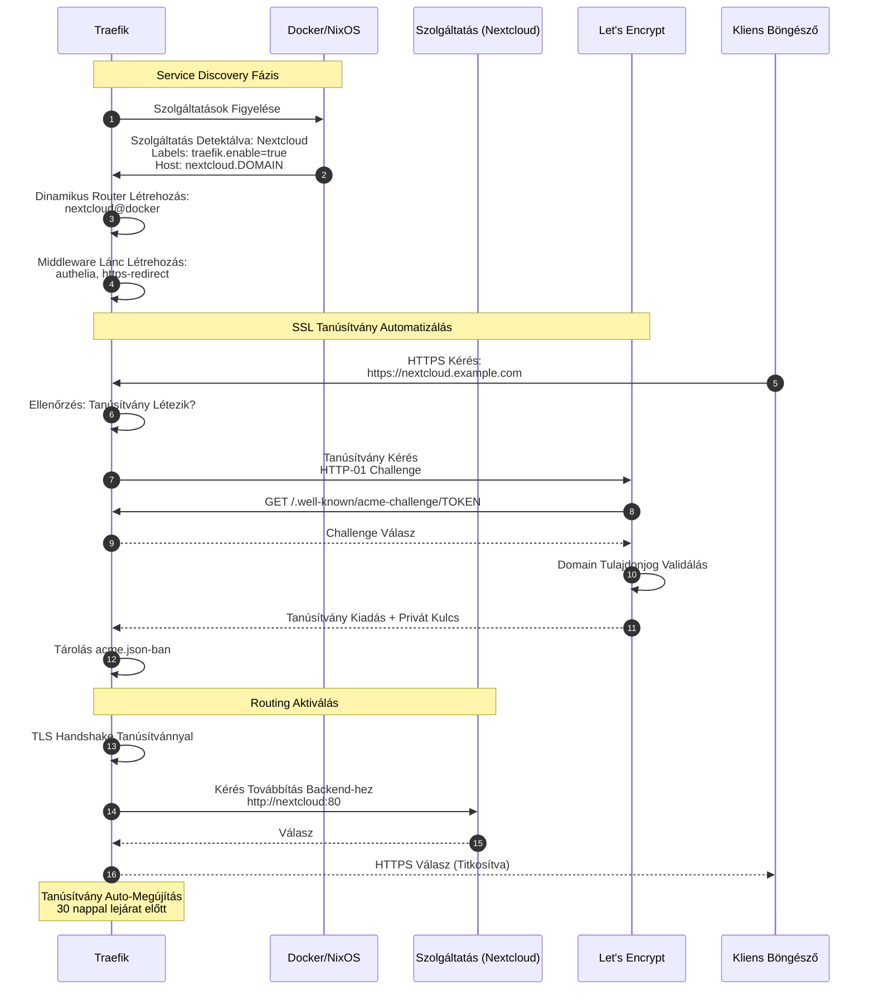

# Fázis 5: Traefik Service Discovery és SSL Automatizálás

Automatikus routing konfiguráció és Let's Encrypt tanúsítvány menedzsment.



## Folyamat Leírása

A Traefik reverse proxy a modern mikroszolgáltatás architektúrák alapvető komponense, amely automatikus service discovery-t és dinamikus routing-ot biztosít. A rendszerben a Traefik folyamatosan figyeli a Docker daemon-t vagy a NixOS konfigurációt, és automatikusan detektálja az új szolgáltatások indítását.

A service discovery mechanizmus Docker környezetben a konténer label-ek olvasásán alapul. Minden szolgáltatás definiál traefik.enable=true label-t az aktiváláshoz, traefik.http.routers.*.rule label-t a routing szabályhoz (általában Host alapú), és traefik.http.services.*.loadbalancer.server.port label-t a backend port meghatározásához. NixOS környezetben ezek a beállítások a szolgáltatás modul konfigurációjában vannak deklarálva.

Amikor egy új szolgáltatás detektálódik, a Traefik automatikusan létrehoz egy dinamikus router-t. Ez a router tartalmazza a routing szabályt (pl. Host(`nextcloud.example.com`)), a middleware lánc hivatkozásokat (authelia forward auth, https redirect), és a backend szolgáltatás címét. A konfiguráció valós időben töltődik be anélkül, hogy a Traefik-et újra kellene indítani.

Az SSL automatizálás a Let's Encrypt ACME protokollt használja. Amikor az első HTTPS kérés érkezik egy domain-re, amelyhez még nincs tanúsítvány, a Traefik automatikusan kezdeményezi a tanúsítvány kérést. A HTTP-01 challenge során a Let's Encrypt szerver egy egyedi token-t kér a .well-known/acme-challenge/ útvonalon, amelyet a Traefik automatikusan szolgál ki, igazolva a domain tulajdonjogot.

Sikeres validáció után a Let's Encrypt kiadja a tanúsítványt és a privát kulcsot, amelyet a Traefik biztonságosan tárol az acme.json fájlban. Ez a fájl 600 permission-nel van védve, mivel tartalmazza a privát kulcsokat. A Traefik ezután használja ezt a tanúsítványt az összes HTTPS kéréshez az adott domain-hez.

A tanúsítvány megújítás automatikusan történik 30 nappal a lejárat előtt. A Traefik háttérfolyamatként ellenőrzi a tanúsítványok lejárati dátumát, és időben kezdeményezi a megújítási folyamatot anélkül, hogy bármilyen szolgáltatáskimaradást okozna. A megújítás során a régi tanúsítvány továbbra is használatban marad, és csak akkor cserélődik le, amikor az új tanúsítvány sikeresen megszerzésre került.

## Traefik Static Configuration (traefik.yml)

```yaml
entryPoints:
  web:
    address: ":80"
  websecure:
    address: ":443"

certificatesResolvers:
  letsencrypt:
    acme:
      email: admin@example.com
      storage: /acme/acme.json
      httpChallenge:
        entryPoint: web
```

## Docker Label Példa

```yaml
labels:
  - "traefik.enable=true"
  - "traefik.http.routers.nextcloud.rule=Host(`nextcloud.example.com`)"
  - "traefik.http.routers.nextcloud.entrypoints=websecure"
  - "traefik.http.routers.nextcloud.tls.certresolver=letsencrypt"
  - "traefik.http.routers.nextcloud.middlewares=authelia@docker"
```

## Middleware Konfiguráció

A Traefik middleware-ek láncolható komponensek, amelyek feldolgozzák a kéréseket routing előtt:
- **https-redirect**: HTTP kérések átirányítása HTTPS-re
- **authelia**: Forward authentication Authelia-hoz
- **rate-limit**: Kérések limitálása DDoS védelem
- **compress**: Gzip tömörítés
- **security-headers**: HTTP biztonsági fejlécek hozzáadása

## Kimenet

A Traefik teljes SSL/TLS kezelést biztosít automatikus tanúsítvány megszerzéssel és megújítással, minden szolgáltatás elérhető HTTPS-en keresztül érvényes tanúsítvánnyal, és a routing konfigurációk valós időben frissülnek új szolgáltatások hozzáadásakor.
