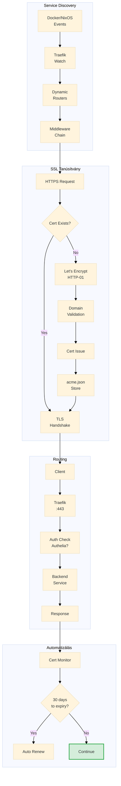

# Fázis 5: Traefik & SSL Automatizálás

```mermaid
%%{init: {'theme':'base', 'themeVariables': { 'fontSize':'13px'}}}%%
flowchart TB
    subgraph DISCOVERY[Service Discovery]
        direction LR
        A[Docker/NixOS<br/>Events] --> B[Traefik<br/>Watch]
        B --> C[Dynamic<br/>Routers]
        C --> D[Middleware<br/>Chain]
    end

    subgraph SSL[SSL Tanúsítvány]
        direction TB
        E[HTTPS Request] --> F{Cert Exists?}
        F -->|No| G[Let's Encrypt<br/>HTTP-01]
        F -->|Yes| K
        G --> H[Domain<br/>Validation]
        H --> I[Cert Issue]
        I --> J[acme.json<br/>Store]
        J --> K[TLS<br/>Handshake]
    end

    subgraph ROUTING[Routing]
        direction LR
        L[Client] --> M[Traefik<br/>:443]
        M --> N[Auth Check<br/>Authelia?]
        N --> O[Backend<br/>Service]
        O --> P[Response]
    end

    subgraph AUTO[Automatizálás]
        direction TB
        Q[Cert Monitor] --> R{30 days<br/>to expiry?}
        R -->|Yes| S[Auto Renew]
        R -->|No| T[Continue]
    end

    D --> E
    K --> L
    P --> Q

    style T fill:#d4edda,stroke:#28a745,stroke-width:2px
```
