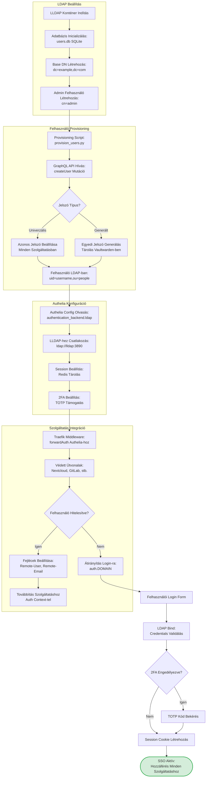

# Fázis 6: LDAP és Authelia SSO Integráció

Központosított autentikáció Single Sign-On-nal az összes szolgáltatás között.



## Folyamat Leírása

A központosított autentikációs architektúra az LLDAP lightweight LDAP szerverre épül, amely SQLite adatbázisban tárolja a felhasználói adatokat. Az LLDAP előnyei közé tartozik az alacsony erőforrásigény, a GraphQL API a modern felhasználói provisioning-hoz, és a teljes LDAP v3 protokoll támogatás, amely kompatibilis a legtöbb enterprise alkalmazással.

Az LDAP beállítási fázis során létrejön a directory information tree (DIT) struktúra. A base DN (dc=example,dc=com) képezi a gyökeret, alatta az organizationalUnit-ok (ou=people, ou=groups) szervezik a felhasználókat és csoportokat. Az admin felhasználó (cn=admin,ou=people,dc=example,dc=com) teljes olvasási és írási jogosultsággal rendelkezik a directory-ra.

A felhasználó provisioning automatizált folyamat, amely a provision_users.py script által vezérelt. Ez a script a Flask alkalmazásból kapja a felhasználói adatokat, és GraphQL mutációkat használ az LLDAP API-ján keresztül a felhasználók létrehozására. A GraphQL előnye, hogy típusbiztos, validálja a bemeneti adatokat, és egy kéréssel több műveletet is végre lehet hajtani.

A jelszó stratégia választás kritikus biztonsági döntés. Az univerzális jelszó megközelítés egyszerűbb felhasználói élményt nyújt, mivel ugyanazt a jelszót használják minden szolgáltatásban, de egyetlen kompromittált jelszó az összes szolgáltatáshoz hozzáférést ad. A generált jelszó stratégia egyedi, kriptográfiailag biztonságos jelszavakat generál minden szolgáltatáshoz, amelyeket biztonságosan tárol a Vaultwarden password manager-ben, és a felhasználó böngésző kiegészítőn keresztül férhet hozzá.

Az Authelia SSO middleware központi szerepet játszik az autentikációs architektúrában. A Traefik forward authentication mechanizmust használja, amely minden védett szolgáltatáshoz érkező kérést először az Authelia-hoz irányít validációra. Az Authelia ellenőrzi a session cookie érvényességét, és ha érvényes session létezik, beállítja a Remote-User és Remote-Email fejléceket, amelyeket a backend szolgáltatások használnak az automatikus bejelentkezéshez.

A session management Redis-ben történik, amely gyors in-memory adattárolást biztosít. Minden sikeres bejelentkezés után egy egyedi session ID generálódik, amely 24 órán keresztül érvényes (konfigurálható). A session cookie httpOnly és secure flag-ekkel van védve, megakadályozva a JavaScript hozzáférést és biztosítva, hogy csak HTTPS-en keresztül küldődik.

A kétfaktoros autentikáció (2FA) TOTP (Time-based One-Time Password) algoritmus alapján működik. A felhasználók QR kóddal párosítják mobilalkalmazásukat (Google Authenticator, Authy) az Authelia-val, és minden bejelentkezéskor egy 6 számjegyű kódot kell megadniuk, amely 30 másodpercenként változik. Ez jelentősen növeli a biztonsági szintet, mivel még a jelszó kompromittálása esetén is szükség van a fizikai eszközre.

## LLDAP GraphQL Példa

```graphql
mutation CreateUser {
  createUser(user: {
    id: "username"
    email: "user@example.com"
    displayName: "User Name"
  }) {
    id
    email
  }
}
```

## Authelia Configuration (authentication_backend)

```yaml
authentication_backend:
  ldap:
    url: ldap://lldap:3890
    base_dn: dc=example,dc=com
    username_attribute: uid
    additional_users_dn: ou=people
    users_filter: (&({username_attribute}={input})(objectClass=person))
    additional_groups_dn: ou=groups
    groups_filter: (member={dn})
```

## Session Configuration

```yaml
session:
  name: authelia_session
  domain: example.com
  expiration: 1h
  inactivity: 24h
  remember_me_duration: 1M
  redis:
    host: redis
    port: 6379
```

## SSO Flow Előnyök

- **Egyszeri bejelentkezés**: Felhasználó egyszer jelentkezik be, minden szolgáltatás elérhető
- **Központi felhasználó kezelés**: Egy helyen történik a felhasználók menedzsmentje
- **Egységes jelszó policy**: LLDAP szinten konfigurálható minimum hossz, komplexitás
- **Audit trail**: Minden bejelentkezési kísérlet naplózva van
- **2FA védelem**: További biztonsági réteg az összes szolgáltatáshoz

## Kimenet

Teljes SSO integráció ahol a felhasználók egyszer bejelentkeznek az auth.example.com domain-en, és automatikus hozzáférést kapnak minden védett szolgáltatáshoz anélkül, hogy újra be kellene jelentkezniük.
