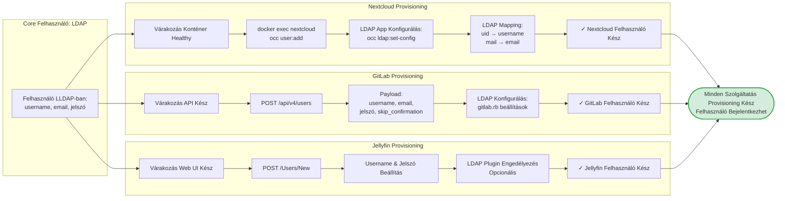

# Fázis 7: Szolgáltatás-Specifikus Post-Deployment Konfiguráció

Szolgáltatásonkénti felhasználó provisioning és LDAP integráció beállítás.



## Folyamat Leírása

A szolgáltatás-specifikus konfiguráció azért szükséges, mert nem minden alkalmazás támogatja natívan az LDAP autentikációt, vagy további beállításokat igényel a teljes integráció eléréséhez. A post-deployment provisioning script-ek automatizálják ezeket a lépéseket, biztosítva a konzisztens felhasználói élményt minden szolgáltatásban.

A Nextcloud provisioning az occ (nextcloud console) parancssori eszközön keresztül történik. Első lépésként a script várakozik a Nextcloud konténer healthy státuszára, amely azt jelzi, hogy a webszerver fut és az adatbázis kapcsolat létrejött. Az occ user:add parancs létrehozza a felhasználót a Nextcloud belső user táblában, még akkor is, ha később LDAP autentikációt használunk. Ez azért fontos, hogy a felhasználó metadata (quota, csoport tagságok) helyileg tárolódjon.

Az LDAP integráció konfiguráció az occ ldap:set-config parancsokkal történik, amely beállítja az LDAP szerver címét, a base DN-t, a user és group filter-eket, és az attribute mapping-eket. A mapping kulcsfontosságú, mivel meghatározza, hogy az LDAP attributumok (uid, mail, displayName) hogyan képződnek le a Nextcloud user tulajdonságaira. Sikeres konfiguráció után a felhasználók LDAP credentials-szel jelentkezhetnek be, de a Nextcloud specifikus adataik (fájlok, megosztások) lokálisan tárolódnak.

A GitLab provisioning a GitLab REST API-ját használja, amely modern JSON alapú interfészt biztosít. A POST /api/v4/users endpoint várja a felhasználó adatokat, beleértve a username, email, password és admin flag-eket. A skip_confirmation paraméter megkerüli az email megerősítési folyamatot, amely tesztkörnyezetben és belső telepítéseknél praktikus. A GitLab natívan támogatja az LDAP-ot a gitlab.rb konfigurációs fájlon keresztül, amely Ruby DSL formátumban van írva.

A GitLab LDAP konfiguráció specifikus beállításokat igényel a group sync-hez. A group_base DN meghatározza, hogy hol keresse az LDAP csoportokat, az admin_group beállítással automatikusan admin jogokat adhatunk LDAP csoport tagoknak, és a sync_ssh_keys opció lehetővé teszi SSH kulcsok szinkronizálását az LDAP directory-ból.

A Jellyfin provisioning egyszerűbb, mivel a Jellyfin elsődleges média szerver funkciója nem igényel komplex jogosultság kezelést. A POST /Users/New API endpoint létrehozza a felhasználót a Jellyfin adatbázisban, beállítja az alapértelmezett jogosultságokat (pl. media playback enabled, admin disabled), és opcionálisan konfigurálható az LDAP plugin a későbbi autentikációhoz. A Jellyfin LDAP plugin külső komponens, amely külön telepítést igényel a plugin repository-ból.

## Nextcloud OCC Parancsok

```bash
# Felhasználó létrehozás
docker exec -u www-data nextcloud php occ user:add \
  --password-from-env \
  --display-name="User Name" \
  --group="users" \
  username

# LDAP konfiguráció
docker exec -u www-data nextcloud php occ ldap:create-empty-config
docker exec -u www-data nextcloud php occ ldap:set-config s01 \
  ldapHost "lldap" \
  ldapPort "3890" \
  ldapBase "dc=example,dc=com" \
  ldapUserFilter "(&(objectClass=person)(uid=%uid))"
```

## GitLab API Példa

```bash
curl --request POST \
  --header "PRIVATE-TOKEN: ${GITLAB_ROOT_TOKEN}" \
  --data "username=username" \
  --data "email=user@example.com" \
  --data "password=${USER_PASSWORD}" \
  --data "skip_confirmation=true" \
  "https://gitlab.example.com/api/v4/users"
```

## Jellyfin API Példa

```bash
curl -X POST \
  -H "X-Emby-Token: ${JELLYFIN_API_KEY}" \
  -H "Content-Type: application/json" \
  -d '{
    "Name": "username",
    "Password": "'"${USER_PASSWORD}"'"
  }' \
  "http://jellyfin:8096/Users/New"
```

## Provisioning Script Struktúra

A provision_users.py script moduláris felépítésű provisioner osztályokkal:

```python
class NextcloudProvisioner:
    def provision_user(self, username, email, password):
        # Wait for service health
        # Execute occ commands
        # Verify user creation
        pass

class GitLabProvisioner:
    def provision_user(self, username, email, password):
        # Wait for API ready
        # POST to /api/v4/users
        # Configure LDAP if needed
        pass
```

## Hibakezelés

Minden provisioner implementál retry logikát:
- Service health check: 30 másodperces timeout, 5 másodperces retry interval
- API calls: 3 retry attempt exponential backoff-fal
- Idempotency: Újrafuttatható script, meglévő felhasználókat nem duplikálja
- Logging: Részletes naplózás minden műveletről provisioning.log-ba

## Kimenet

Minden engedélyezett szolgáltatásban létrejön a felhasználói fiók, LDAP integráció konfigurálva (ahol támogatott), és a felhasználó azonnal bejelentkezhet minden szolgáltatásba az LDAP credentials-szel az Authelia SSO-n keresztül.
