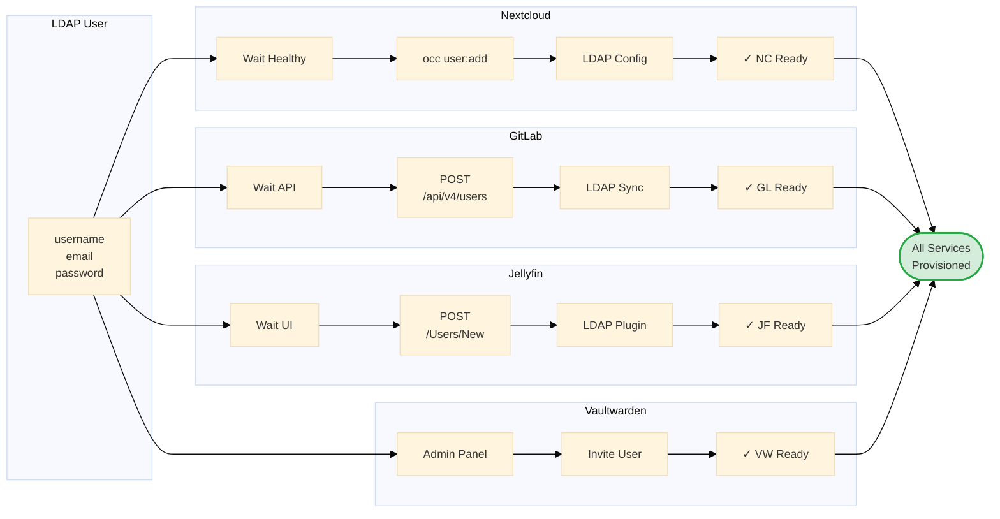

# Fázis 7: Szolgáltatás Konfiguráció

```mermaid
%%{init: {'theme':'base', 'themeVariables': { 'fontSize':'13px'}}}%%
flowchart LR
    subgraph CORE[LDAP User]
        A[username<br/>email<br/>password]
    end

    subgraph NC[Nextcloud]
        direction TB
        B[Wait Healthy] --> C[occ user:add]
        C --> D[LDAP Config]
        D --> E[✓ NC Ready]
    end

    subgraph GL[GitLab]
        direction TB
        F[Wait API] --> G[POST<br/>/api/v4/users]
        G --> H[LDAP Sync]
        H --> I[✓ GL Ready]
    end

    subgraph JF[Jellyfin]
        direction TB
        J[Wait UI] --> K[POST<br/>/Users/New]
        K --> L[LDAP Plugin]
        L --> M[✓ JF Ready]
    end

    subgraph VW[Vaultwarden]
        direction TB
        N[Admin Panel] --> O[Invite User]
        O --> P[✓ VW Ready]
    end

    A --> B & F & J & N
    E & I & M & P --> Q([All Services<br/>Provisioned])

    style Q fill:#d4edda,stroke:#28a745,stroke-width:2px
```
