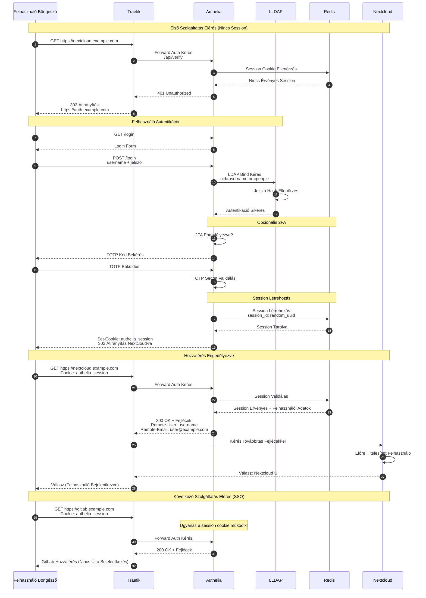

# Fázis 8: Végfelhasználói Hozzáférés SSO-val

Teljes autentikációs folyamat böngészőtől a szolgáltatás eléréséig.



## Folyamat Leírása

A végfelhasználói hozzáférési folyamat az SSO (Single Sign-On) koncepció gyakorlati megvalósítása, ahol egyetlen bejelentkezéssel minden védett szolgáltatás elérhető. Az első szolgáltatás elérésekor a böngésző HTTPS GET kérést küld a Traefik-nek, amely az összes bejövő kérés belépési pontja.

A Traefik forward authentication middleware-e automatikusan továbbítja az autentikációs kérést az Authelia /api/verify endpoint-jára. Ez a kérés tartalmazza az eredeti URL-t és minden cookie-t, amely a böngészőben van. Az Authelia ellenőrzi, hogy létezik-e érvényes authelia_session cookie, és ha nem, akkor 401 Unauthorized válasszal tér vissza, amely triggereli a Traefik-et, hogy 302 átirányítást küldjön a felhasználónak az auth.example.com login oldalra.

A login oldalon a felhasználó megadja a username és password credentials-t. Az Authelia LDAP bind műveletet végez az LLDAP szerveren, amely az LDAP protokoll standard autentikációs mechanizmusa. A bind művelet megpróbálja a megadott jelszóval kapcsolódni a felhasználó DN-jéhez (uid=username,ou=people,dc=example,dc=com), és az LDAP szerver ellenőrzi a jelszó hash-t. Sikeres bind esetén az autentikáció elfogadott.

Ha a felhasználónak engedélyezve van a kétfaktoros autentikáció, az Authelia prompt-olja a TOTP (Time-based One-Time Password) kód megadását. A TOTP algoritmus a felhasználó titkos kulcsát és az aktuális Unix timestamp-et használja egy 6 számjegyű kód generálására, amely 30 másodpercenként változik. Az Authelia ugyanezt az algoritmust futtatja a tárolt secret-tel, és összehasonlítja az eredményt a felhasználó által megadott kóddal.

Sikeres autentikáció után az Authelia generál egy kriptográfiailag biztonságos random UUID-t session azonosítónak, és ezt tárolja a Redis-ben a felhasználói metaadatokkal együtt (username, email, groups, authentication time). A session cookie httpOnly flag-gel van beállítva, amely megakadályozza a JavaScript hozzáférést, és secure flag-gel, amely biztosítja, hogy csak HTTPS-en keresztül küldődik.

A böngésző ekkor átirányításra kerül az eredeti URL-re (nextcloud.example.com), most már a session cookie-val. A Traefik ismét forward auth-ot végez az Authelia-hoz, de most a session érvényes, így az Authelia 200 OK választ ad vissza speciális fejlécekkel: Remote-User tartalmazza a felhasználónevet, Remote-Email az email címet, és opcionálisan Remote-Groups a felhasználó csoportjait.

A Nextcloud backend megkapja ezeket a fejléceket, és mivel LDAP autentikációja van konfigurálva, automatikusan bejelentkezteti a felhasználót anélkül, hogy további jelszót kérne. Ez az "pre-authentication" mechanizmus, ahol a Nextcloud megbízik a Traefik által küldött fejlécekben, mivel a kérés csak az Authelia validáláson keresztül juthatott el hozzá.

Az SSO legnagyobb előnye akkor mutatkozik meg, amikor a felhasználó egy másik szolgáltatást akar elérni. A gitlab.example.com felé küldött kérés automatikusan tartalmazza az authelia_session cookie-t, mivel ugyanazon a domain-en van beállítva (example.com). Az Authelia azonnal validálja a session-t Redis-ből anélkül, hogy újra LDAP bind-ot kellene végeznie, és a GitLab is automatikusan bejelentkezteti a felhasználót a Remote-User fejléc alapján.

## Session Cookie Részletek

```
Set-Cookie: authelia_session=<encrypted_session_id>;
  Domain=.example.com;
  Path=/;
  HttpOnly;
  Secure;
  SameSite=Lax;
  Max-Age=3600
```

## Authelia Remote Headers

```
Remote-User: username
Remote-Email: user@example.com
Remote-Name: User Full Name
Remote-Groups: users,admins
```

## Session Tárolás Redis-ben

```json
{
  "session_id": "uuid-v4",
  "username": "username",
  "authentication_level": "two_factor",
  "authentication_time": 1234567890,
  "expiration": 1234571490,
  "groups": ["users", "admins"]
}
```

## TOTP Algoritmus Példa

```python
import hmac
import struct
import time

def generate_totp(secret, time_step=30):
    timestamp = int(time.time() // time_step)
    message = struct.pack(">Q", timestamp)
    hmac_hash = hmac.new(secret, message, 'sha1').digest()
    offset = hmac_hash[-1] & 0x0f
    code = struct.unpack(">I", hmac_hash[offset:offset+4])[0]
    code = (code & 0x7fffffff) % 1000000
    return f"{code:06d}"
```

## Biztonsági Tulajdonságok

- **Session Timeout**: Inaktivitás után automatikus kijelentkezés (konfigurálandó)
- **Remember Me**: Opcionális hosszabb session (30 nap) checkbox-szal
- **Session Invalidation**: Jelszó változtatáskor minden session invalidálódik
- **Concurrent Sessions**: Több eszközről egyidejű bejelentkezés támogatva
- **IP Validation**: Opcionális session IP cím ellenőrzés session hijacking ellen

## Kimenet

A felhasználó egyszer bejelentkezik az auth.example.com oldalon, és ezután automatikus hozzáférést kap minden védett szolgáltatáshoz (Nextcloud, GitLab, Jellyfin, stb.) anélkül, hogy minden szolgáltatásban külön be kellene jelentkeznie, biztosítva a zökkenőmentes felhasználói élményt.
