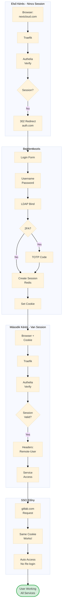

# Fázis 8: Felhasználói Hozzáférés SSO

```mermaid
%%{init: {'theme':'base', 'themeVariables': { 'fontSize':'13px'}}}%%
flowchart TB
    subgraph REQ1[Első Kérés - Nincs Session]
        direction LR
        A[Browser:<br/>nextcloud.com] --> B[Traefik]
        B --> C[Authelia<br/>Verify]
        C --> D{Session?}
        D -->|No| E[302 Redirect<br/>auth.com]
    end

    subgraph LOGIN[Bejelentkezés]
        direction TB
        F[Login Form] --> G[Username<br/>Password]
        G --> H[LDAP Bind]
        H --> I{2FA?}
        I -->|Yes| J[TOTP Code]
        I -->|No| K
        J --> K[Create Session<br/>Redis]
        K --> L[Set Cookie]
    end

    subgraph REQ2[Második Kérés - Van Session]
        direction LR
        M[Browser +<br/>Cookie] --> N[Traefik]
        N --> O[Authelia<br/>Verify]
        O --> P{Session<br/>Valid?}
        P -->|Yes| Q[Headers:<br/>Remote-User]
        Q --> R[Service<br/>Access]
    end

    subgraph SSO[SSO Előny]
        direction TB
        S[gitlab.com<br/>Request] --> T[Same Cookie<br/>Works!]
        T --> U[Auto Access<br/>No Re-login]
    end

    E --> F
    L --> M
    R --> S
    U --> V([User Working<br/>All Services])

    style V fill:#d4edda,stroke:#28a745,stroke-width:2px
```
