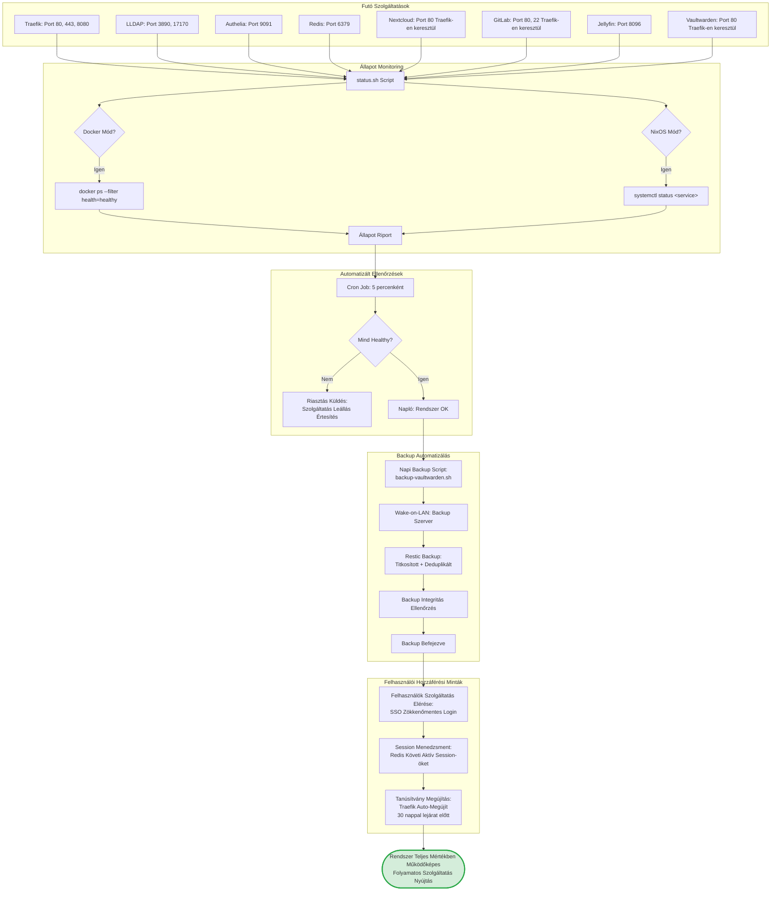

# Fázis 9: Működési Állapot és Monitoring

Teljes mértékben működő rendszer állapotfigyeléssel és automatizált ellenőrzésekkel.



## Folyamat Leírása

A működési állapot fázis a rendszer végleges, production-ready konfigurációját jelenti, ahol minden szolgáltatás fut, monitorozva van, és automatizált folyamatok biztosítják a folyamatos rendelkezésre állást. Ez a fázis demonstrálja a Platform-as-a-Service rendszer önálló működési képességét minimális manuális beavatkozással.

A futó szolgáltatások architektúrája réteges felépítésű. Az infrastructure réteg tartalmazza a Traefik reverse proxy-t (port 80/443 külső hozzáférés, port 8080 dashboard), a Redis cache-t (port 6379 session storage), és az LLDAP címtárszolgáltatást (port 3890 LDAP, port 17170 web UI). Az authentication réteg az Authelia SSO middleware (port 9091), amely minden szolgáltatás elé kerül. Az application réteg tartalmazza a tényleges PaaS szolgáltatásokat, amelyek mindegyike a Traefik-en keresztül érhető el HTTPS-szel.

A status.sh monitoring script intelligensen detektálja a deployment módot és ennek megfelelően ellenőrzi a szolgáltatások állapotát. Docker környezetben a docker ps parancsot használja health status filter-rel, amely ellenőrzi a konténer health check-ek eredményét. NixOS környezetben a systemctl status parancsokat futtat minden szolgáltatásra, és parse-olja az active/inactive státuszt. A script kimenetét táblázatos formában jeleníti meg, megmutatva minden szolgáltatás nevét, állapotát, portjait és uptime-ját.

A monitoring script cron job-ként fut 5 percenként, amely rövid elég ahhoz, hogy gyorsan detektáljon service failure-t, de nem túl gyakori, hogy ne terhelje a rendszert. Minden futáskor a script ellenőrzi az összes kritikus szolgáltatást, és ha bármelyik nem healthy státuszban van, automatikus riasztást küld. A riasztási mechanizmus konfigurálható email-re, Slack-re vagy más notification szolgáltatásra a notification.sh script-en keresztül.

A backup automatizálás kritikus komponens az adatvesztés elkerülésére. A backup stratégia a Restic backup tool-t használja, amely modern, titkosított, deduplikált backup-okat készít. A Vaultwarden jelszóadatbázis naponta backup-olásra kerül, mivel ez tartalmazza az összes generált jelszót. A backup folyamat első lépése a backup szerver felébresztése Wake-on-LAN magic packet-tel, amely lehetővé teszi, hogy a backup szerver normál időben kikapcsolva legyen energia megtakarítás céljából.

A Restic backup folyamat titkosítja az adatokat AES-256 algoritmussal mielőtt továbbítaná őket, így még ha a backup storage kompromittálódik, az adatok védve maradnak. A deduplikáció jelentősen csökkenti a tárolási igényt, mivel csak a megváltozott file chunk-ok kerülnek tárolásra. A backup befejezése után a script integrity check-et futtat, amely ellenőrzi, hogy a backup-olt adatok helyesen visszaállíthatók-e.

A felhasználói hozzáférési minták monitorozása a Redis session store-on keresztül történik. A Redis KEYS authelia_session:* parancs listázza az összes aktív session-t, amelyből statisztikák generálhatók az aktív felhasználók számáról, a peak usage time-ról, és az átlagos session időtartamról. Ezek a metrikák értékesek a capacity planning-hez és a performance optimization-höz.

A Traefik tanúsítvány megújítási folyamat teljesen automatizált háttérfolyamat. A Traefik 30 nappal a tanúsítvány lejárata előtt kezdeményezi a renewal folyamatot a Let's Encrypt-tel, amely ugyanazt a HTTP-01 challenge mechanizmust használja mint az eredeti tanúsítvány kérés. A megújítás során nincs downtime, mivel a régi tanúsítvány továbbra is használatban van, amíg az új sikeresen meg nem érkezik.

## Status Script Output Példa

```
PaaS Infrastructure Status Report
Generated: 2024-01-15 14:30:00

Docker Services:
━━━━━━━━━━━━━━━━━━━━━━━━━━━━━━━━━━━━━━━━━━━━━━━━
Service         Status    Ports           Uptime
━━━━━━━━━━━━━━━━━━━━━━━━━━━━━━━━━━━━━━━━━━━━━━━━
traefik         healthy   80,443,8080     5d 12h
lldap           healthy   3890,17170      5d 12h
authelia        healthy   9091            5d 12h
redis           healthy   6379            5d 12h
nextcloud       healthy   80              5d 11h
gitlab          healthy   80,22           5d 11h
jellyfin        healthy   8096            5d 11h
vaultwarden     healthy   80              5d 11h
━━━━━━━━━━━━━━━━━━━━━━━━━━━━━━━━━━━━━━━━━━━━━━━━

Summary: 8/8 services healthy ✓
```

## Cron Job Konfiguráció

```bash
# /etc/cron.d/paas-monitoring
*/5 * * * * root /opt/paas/scripts/status.sh >> /var/log/paas/status.log 2>&1
0 2 * * * root /opt/paas/scripts/backup-vaultwarden.sh >> /var/log/paas/backup.log 2>&1
0 3 * * 0 root /opt/paas/scripts/cleanup-old-backups.sh >> /var/log/paas/cleanup.log 2>&1
```

## Restic Backup Parancsok

```bash
# Backup létrehozás
restic -r /mnt/backup/vaultwarden backup /var/lib/vaultwarden \
  --tag daily \
  --exclude '*.log' \
  --password-file /root/.restic-password

# Backup integritás ellenőrzés
restic -r /mnt/backup/vaultwarden check \
  --password-file /root/.restic-password

# Régi backup-ok törlése (90 nap után)
restic -r /mnt/backup/vaultwarden forget \
  --keep-daily 7 \
  --keep-weekly 4 \
  --keep-monthly 12 \
  --prune \
  --password-file /root/.restic-password
```

## Redis Session Monitoring

```bash
# Aktív session-ök száma
redis-cli KEYS "authelia_session:*" | wc -l

# Session részletek
redis-cli GET "authelia_session:uuid-here"

# Session TTL ellenőrzés
redis-cli TTL "authelia_session:uuid-here"
```

## Notification Script Példa

```bash
#!/bin/bash
# notification.sh - Service down alert

SERVICE_NAME=$1
SERVICE_STATUS=$2

if [ "$SERVICE_STATUS" != "healthy" ]; then
  # Email notification
  echo "ALERT: $SERVICE_NAME is $SERVICE_STATUS" | \
    mail -s "PaaS Service Alert" admin@example.com

  # Slack notification
  curl -X POST -H 'Content-type: application/json' \
    --data "{\"text\":\"⚠️ $SERVICE_NAME is $SERVICE_STATUS\"}" \
    https://hooks.slack.com/services/YOUR/WEBHOOK/URL
fi
```

## Prometheus Metrics (Opcionális)

A rendszer opcionálisan exportálhat Prometheus metrikákat:
- `paas_service_up{service="nextcloud"}` - Service availability (0 vagy 1)
- `paas_active_sessions` - Aktív user session-ök száma
- `paas_backup_last_success` - Utolsó sikeres backup timestamp
- `paas_certificate_expiry_days{domain="nextcloud.example.com"}` - SSL tanúsítvány lejárat

## Kimenet

A rendszer teljesen operatív állapotban van, automatizált monitoring biztosítja a proaktív hibadetektálást, napi backup-ok védik az adatokat, és a felhasználók zavartalanul használhatják az összes szolgáltatást zökkenőmentes SSO-val.
