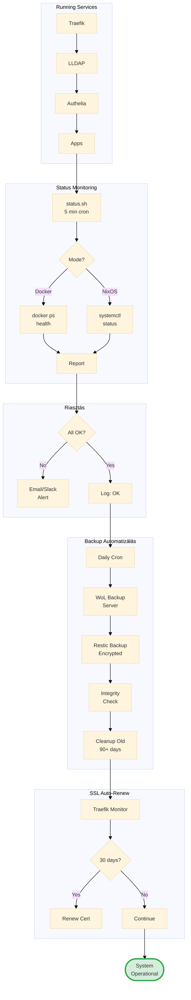

# Fázis 9: Monitoring & Backup

```mermaid
%%{init: {'theme':'base', 'themeVariables': { 'fontSize':'13px'}}}%%
flowchart TB
    subgraph SERVICES[Running Services]
        direction LR
        A[Traefik] --> B[LLDAP]
        B --> C[Authelia]
        C --> D[Apps]
    end

    subgraph MONITOR[Status Monitoring]
        direction TB
        E[status.sh<br/>5 min cron] --> F{Mode?}
        F -->|Docker| G[docker ps<br/>health]
        F -->|NixOS| H[systemctl<br/>status]
        G --> I[Report]
        H --> I
    end

    subgraph ALERT[Riasztás]
        direction LR
        J{All OK?}
        J -->|No| K[Email/Slack<br/>Alert]
        J -->|Yes| L[Log: OK]
    end

    subgraph BACKUP[Backup Automatizálás]
        direction TB
        M[Daily Cron] --> N[WoL Backup<br/>Server]
        N --> O[Restic Backup<br/>Encrypted]
        O --> P[Integrity<br/>Check]
        P --> Q[Cleanup Old<br/>90+ days]
    end

    subgraph AUTO[SSL Auto-Renew]
        direction LR
        R[Traefik Monitor] --> S{30 days?}
        S -->|Yes| T[Renew Cert]
        S -->|No| U[Continue]
    end

    D --> E
    I --> J
    L --> M
    Q --> R
    U --> V([System<br/>Operational])

    style V fill:#d4edda,stroke:#28a745,stroke-width:3px
```
