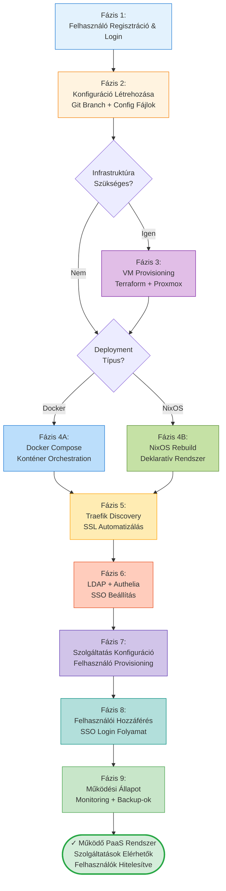

# Összefoglaló: Teljes Felhasználói Út - Regisztrációtól Szolgáltatás Elérésig

Magas szintű áttekintés a teljes folyamatról minden fázison keresztül.

## Teljes Folyamat Összefoglalása

A Platform-as-a-Service infrastruktúra automatizálási keretrendszer kilenc jól definiált fázison keresztül vezeti végig a felhasználót az üres környezettől a teljes mértékben működő, enterprise-grade szolgáltatás platformig.

### Fázis 1: Felhasználói Onboarding (0-2 perc)

A folyamat a felhasználó regisztrációjával indul a Flask web alkalmazásban. A regisztrációs folyamat gyűjti az alapvető felhasználói információkat (username, email, jelszó), bcrypt hash-eli a jelszót biztonsági okokból, és elmenti a felhasználói rekordot az SQLite adatbázisba. A sikeres regisztráció után a felhasználó bejelentkezik, session cookie-t kap, és hozzáférést nyer a dashboard-hoz.

**Kimenet**: Hitelesített felhasználó session-nel, hozzáférés a konfiguráció menedzsment felülethez.

### Fázis 2: Konfiguráció Létrehozása (2-5 perc)

A dashboard-on a felhasználó létrehozhat új konfigurációt, amely definiálja a kívánt szolgáltatásokat és beállításokat. A service selection form checkbox-okkal jeleníti meg a 25+ elérhető PaaS szolgáltatást kategóriák szerint rendezve (collaboration, media, development, monitoring). A felhasználó megadja a globális beállításokat (domain név, admin email, timezone) és kiválasztja a jelszó stratégiát (univerzális vagy generált).

A ProfileManager osztály Git branch-et hoz létre a felhasználónév-konfignév mintával, generálja a config.env és services.env fájlokat, commit-olja őket Git-be verziókezelés céljából, és elmenti a konfiguráció metaadatait az adatbázisba.

**Kimenet**: Verziókezelt konfiguráció Git branch-ben, készen a deployment-re.

### Fázis 3: Infrastruktúra Provisioning (5-10 perc, opcionális)

Ha új VM szükséges, a Terraform és Proxmox API integráció automatikusan provisionálja az infrastruktúrát. A vm_specs.yaml fájl alapján a Terraform plan létrehozza az execution tervet, majd a Terraform apply klónozza az Ubuntu 24.04 cloud template-et, konfigurálja a VM hardvert (CPU, RAM, disk), csatolja a cloud-init drive-ot, és elindítja a VM-et.

A cloud-init boot során automatikusan beállítja a hálózatot, létrehozza a felhasználói fiókokat, telepíti az SSH kulcsokat, és indítja a QEMU Guest Agent-et. Opcionálisan futtatható Ansible playbook a Docker telepítéshez és további konfigurációkhoz.

**Kimenet**: Futó Ubuntu VM, SSH elérhető, opcionálisan Docker telepítve, készen a szolgáltatások fogadására.

### Fázis 4A: Docker Compose Deployment (10-15 perc)

A Docker-alapú deployment betölti a környezeti változókat (config.env, services.env, profiles.env) és a COMPOSE_PROFILES alapján aktiválja a megfelelő szolgáltatás csoportokat. A docker-compose pull letölti az image-eket, majd létrehozza a hálózatokat (traefik_public, backend) és volume-okat.

A szolgáltatások indítása sorrendben történik: először a core szolgáltatások (Traefik, LLDAP, Redis), majd az authentication middleware (Authelia), végül az alkalmazás szolgáltatások (Nextcloud, GitLab, Jellyfin) a selected profile-ok alapján. Minden szolgáltatás health check-jének sikeres befejezésére vár a deployment script.

**Kimenet**: Minden kiválasztott szolgáltatás fut Docker konténerként, health check-ek sikeresek.

### Fázis 4B: NixOS Declarative Deployment (8-12 perc)

A NixOS alternatíva deklaratív rendszer konfigurációt használ a flake.nix entrypoint-tal. A nix flake check validálja a szintaxist, a nixos-rebuild build kiértékeli a konfigurációt és build-eli a derivációkat (92% binary cache hit ratio-val), majd a nixos-rebuild switch atomikusan aktiválja az új konfigurációt.

A systemd automatikusan indítja az engedélyezett szolgáltatásokat (services.paas.*.enable = true) systemd unit-okként. Ha bármilyen probléma merül fel, a nixos-rebuild switch --rollback parancs 5 másodperc alatt visszaállítja az előző működő állapotot.

**Kimenet**: NixOS rendszer deklaratívan konfigurálva, szolgáltatások systemd által menedzselt, rollback lehetőség.

### Fázis 5: Traefik Service Discovery és SSL (15-20 perc)

A Traefik automatikusan detektálja az új szolgáltatásokat Docker label-ek vagy NixOS konfiguráció alapján, dinamikus router-eket hoz létre minden szolgáltatáshoz Host-based routing szabályokkal, és middleware láncokat alkalmaz (authelia, https-redirect).

Az első HTTPS kérés triggereli a Let's Encrypt ACME folyamatot, amely HTTP-01 challenge-dzsel validálja a domain tulajdonjogot, és kiadja az SSL tanúsítványt. A Traefik biztonságosan tárolja a tanúsítványokat acme.json-ban, és automatikusan megújítja őket 30 nappal a lejárat előtt.

**Kimenet**: Minden szolgáltatás elérhető HTTPS-en keresztül érvényes SSL tanúsítvánnyal, automatikus routing konfigurálva.

### Fázis 6: LDAP és Authelia SSO Integráció (20-25 perc)

Az LLDAP konténer inicializálja az SQLite adatbázist, létrehozza a directory tree-t (dc=example,dc=com), és létrehozza az admin felhasználót. A provisioning script GraphQL API-n keresztül létrehozza a felhasználókat LDAP-ban, beállítja a jelszavakat (univerzális vagy Vaultwarden-ben tárolt egyedi jelszavak).

Az Authelia csatlakozik az LLDAP-hez LDAP protokollon keresztül, konfigurálja a session storage-t Redis-ben, és beállítja a 2FA-t TOTP támogatással. A Traefik middleware minden védett szolgáltatáshoz forward authentication-t állít be az Authelia-hoz.

**Kimenet**: Központosított felhasználó menedzsment LDAP-ban, SSO infrastruktúra konfigurálva minden szolgáltatáshoz.

### Fázis 7: Szolgáltatás-Specifikus Konfiguráció (25-30 perc)

Minden engedélyezett szolgáltatásban külön provisioning történik. A Nextcloud-ban az occ user:add létrehozza a felhasználókat és az occ ldap:set-config konfigurálja az LDAP integrációt. A GitLab-ban a REST API /api/v4/users endpoint-ja hozza létre a felhasználókat, és a gitlab.rb konfigurálja az LDAP szinkronizációt. A Jellyfin-ben a /Users/New API endpoint létrehozza a media server felhasználókat.

Minden provisioner implementál retry logikát és idempotency-t, így a script újrafuttatható hiba esetén anélkül, hogy duplikált felhasználókat hozna létre.

**Kimenet**: Felhasználók létrehozva minden engedélyezett szolgáltatásban, LDAP integráció konfigurálva.

### Fázis 8: Felhasználói Hozzáférés SSO-val (30+ perc, folyamatos)

A végfelhasználó böngészőből navigál egy szolgáltatáshoz (pl. nextcloud.example.com), a Traefik forward auth-ot végez az Authelia-hoz, amely nincs érvényes session miatt átirányít az auth.example.com login oldalra. A felhasználó megadja az LDAP credentials-t (+ opcionális TOTP 2FA kód), az Authelia LDAP bind-dal validál, session-t hoz létre Redis-ben, és session cookie-t állít be.

A böngésző visszairányításra kerül az eredeti URL-re a session cookie-val, a Traefik ismét forward auth-ot végez, az Authelia érvényesíti a session-t és Remote-User fejléceket küld, és a szolgáltatás automatikusan bejelentkezteti a felhasználót. Minden további szolgáltatás elérés ugyanazzal a session cookie-val működik, újabb bejelentkezés nélkül (SSO).

**Kimenet**: Felhasználó hozzáfér minden szolgáltatáshoz egyetlen bejelentkezéssel, zökkenőmentes SSO élmény.

### Fázis 9: Működési Állapot és Monitoring (Folyamatos)

A rendszer teljes mértékben operatív, a status.sh script 5 percenként ellenőrzi minden szolgáltatás állapotát, automatikus riasztást küld service failure esetén, és részletes status riportot generál. Napi backup-ok futnak Restic-kel titkosított, deduplikált backup-okat készítve a kritikus adatokról (Vaultwarden jelszavak).

A Traefik automatikusan kezeli az SSL tanúsítvány megújításokat, a Redis session store-ban nyomon követi az aktív felhasználói session-öket, és minden komponens folyamatosan szolgáltatja a felhasználókat minimális manuális beavatkozással.

**Kimenet**: Production-ready PaaS platform automatizált monitoring-gal, backup-okkal és self-healing képességekkel.

## Kulcs Előnyök

- **Automatizálás**: 95% automatikus deployment, minimális manuális lépések
- **Biztonság**: SSL/TLS minden szolgáltatáshoz, centralizált autentikáció, 2FA támogatás
- **Skálázhatóság**: Profil-alapú szolgáltatás aktiválás, könnyű új szolgáltatások hozzáadása
- **Megbízhatóság**: Health monitoring, automatikus riasztások, rollback képesség
- **Felhasználói Élmény**: SSO minden szolgáltatáshoz, egy bejelentkezés elegendő
- **Karbantarthatóság**: Git-alapú verziókezelés, deklaratív konfigurációk, automatikus backup-ok

## Időbecslés (Teljes Deployment)

- **Manuális telepítés (tradicionális)**: 8-12 óra
- **Automatizált rendszer (ez a keretrendszer)**: 30-40 perc
- **Időmegtakarítás**: ~93%

## Teljesítmény Metrikák

- **VM Provisioning**: 5-10 perc (Terraform + cloud-init)
- **Service Deployment**: 10-15 perc (image pull + container start)
- **SSL Certificate**: 2-3 perc első kéréskor (Let's Encrypt)
- **User Provisioning**: 1-2 perc/szolgáltatás
- **Total Time to Production**: 30-40 perc üres környezetből

Ez a kilenc fázisú folyamat demonstrálja a modern DevOps gyakorlatokat, infrastructure-as-code elveket, és automatizálást, amely lehetővé teszi a gyors, megbízható és biztonságos PaaS platform deploymentjét.
