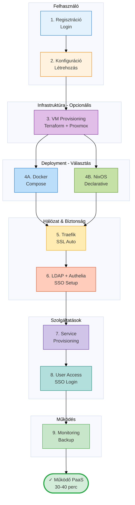

# Összefoglaló: Teljes Folyamat

```mermaid
%%{init: {'theme':'base', 'themeVariables': { 'fontSize':'14px'}}}%%
flowchart TB
    subgraph USER[Felhasználó]
        direction LR
        P1[1. Regisztráció<br/>Login]
        P2[2. Konfiguráció<br/>Létrehozás]
        P1 --> P2
    end

    subgraph INFRA[Infrastruktúra - Opcionális]
        P3[3. VM Provisioning<br/>Terraform + Proxmox]
    end

    subgraph DEPLOY[Deployment - Választás]
        direction LR
        P4A[4A. Docker<br/>Compose]
        P4B[4B. NixOS<br/>Declarative]
    end

    subgraph NETWORK[Hálózat & Biztonság]
        direction TB
        P5[5. Traefik<br/>SSL Auto]
        P6[6. LDAP + Authelia<br/>SSO Setup]
        P5 --> P6
    end

    subgraph SERVICES[Szolgáltatások]
        direction LR
        P7[7. Service<br/>Provisioning]
        P8[8. User Access<br/>SSO Login]
        P7 --> P8
    end

    subgraph OPS[Működés]
        P9[9. Monitoring<br/>Backup]
    end

    P2 --> P3
    P3 --> P4A & P4B
    P4A & P4B --> P5
    P6 --> P7
    P8 --> P9

    P9 --> FINAL([✓ Működő PaaS<br/>30-40 perc])

    style P1 fill:#e3f2fd,stroke:#1976d2
    style P2 fill:#fff3e0,stroke:#f57c00
    style P3 fill:#e1bee7,stroke:#7b1fa2
    style P4A fill:#bbdefb,stroke:#1976d2
    style P4B fill:#c5e1a5,stroke:#558b2f
    style P5 fill:#ffecb3,stroke:#ffa000
    style P6 fill:#ffccbc,stroke:#e64a19
    style P7 fill:#d1c4e9,stroke:#5e35b1
    style P8 fill:#b2dfdb,stroke:#00897b
    style P9 fill:#c8e6c9,stroke:#43a047
    style FINAL fill:#d4edda,stroke:#28a745,stroke-width:3px
```
